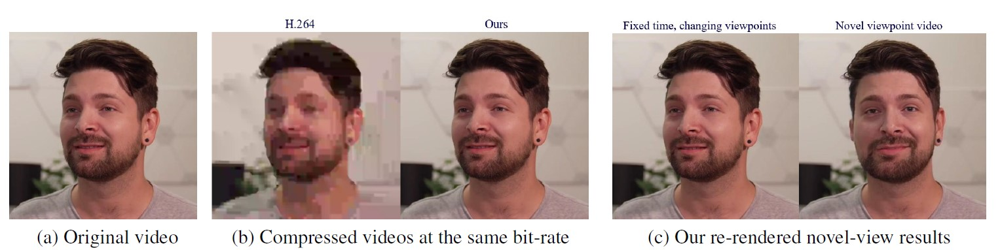
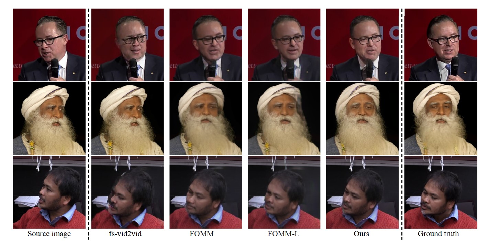
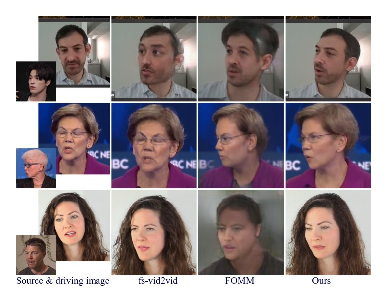
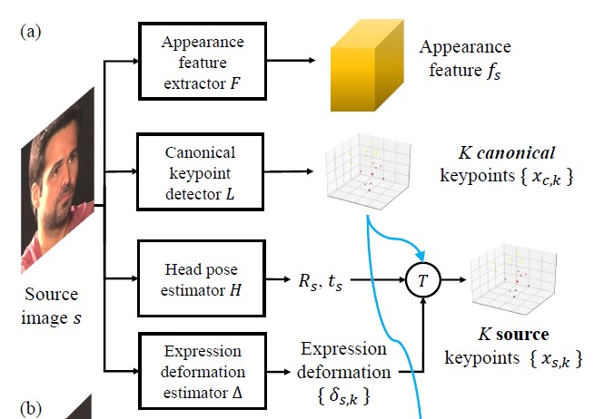
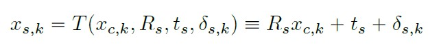
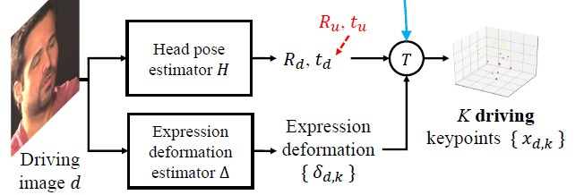
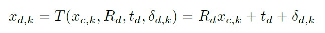
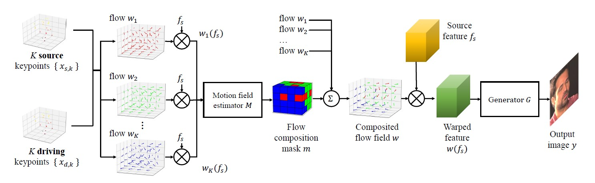
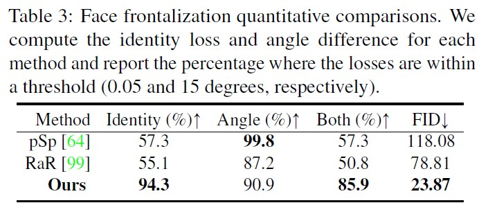
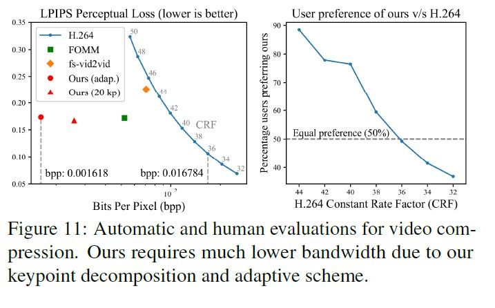

## Face-Vid2Vid : One-Shot Free-View Neural Talking-Head Synthesis for Video Conferencing  

### 논문의 연구 목적 
---
 

 
 
&nbsp; 저자들은 talking-head 비디오를 바탕으로 deep neural network를 사용해 새로운 영상을 합성하고자 한다. 새로운 영상을 합성해낼 뿐만 아니라 비디오 압축 문제에 있어서도 효율성을 극대화하고자 한다. 

 
 

 

&nbsp;  첫째, talking-head image synthesis이다. talking-head image synthesis는 주어진 원본 영상의 말하는 사람에 대한 정보를 바탕으로 머리 위치와 감정 표현을 합성해낸다. talking-head image synthesis는 same-identity reconstruction과 cross-identity motion transfer라는 하위 분야로 나뉜다.  same-identity reconstruction은 원본 영상의 말하는 사람의 머리 위치와 감정 표현을 바꿔서 만들어낸다. 반면, cross-identity motion transfer는 어떤 영상에서 말하는 사람에 대해 원본 영상에서 말하는 사람의 머리 위치와 감정 표현을 적용하는 것이다.  
 

 

&nbsp; 둘째, face redirection이다. 원본 영상에서 말하는 사람의 감정 표현은 그대로 유지하되, 머리 위치를 바꾼 영상을 합성해내는 것이다. face redirection의 예로, 카메라에 말하는 사람의 얼굴의 정면이 보이게끔 하는 face frontalization이 있다.

 

&nbsp; 셋째, video compression이다. video compression은 말 그대로 비디오를 효율적으로 압축하는 것을 의미한다. 저자들은 새로운 모델을 제시 비디오 스트리밍에서 대역폭을 줄이고자 한다.

 

&nbsp;  저자들은 위에서 설명한 분야들의 state-of-the-art model들보다 뛰어난 성능을 보이는 것을 목표로 한다. 

 

### 선행 연구의 한계
---
 

&nbsp; talking head synthesis 분야와 video compression 분야에서 어떤 선행 연구들이 있었고, 각 연구에서의 한계가 무엇인지를 알아보고자 한다. 

 

&nbsp; talking head synthesis 분야에서는 첫째, 3D-based method가 있다. 3D-based method  중 subject-dependent model을 사용하는 전통적인 method가 있고, 최신 method로는 subject-agnostic model이 있다. 전통적인 모델인 subject-dependent model은 오직 한 인물에 대해서만 합성해낼 수 있고, 머리의 위치를 그대로 둔 채 감정 표현만 바꾸는 한계가 있다. 반면, 상대적으로 최신 모델인 subject-agnostic model은 인물에 대한 제약은 없지만, 머리카락, 치아, 장신구 등을 제대로 표현하지 못하는 한계가 있다. 

 

&nbsp; talking head synthesis 분야에서 둘째, 2D-based method가 있다. 2D-based method는 3D-based method와 달리 원본 영상으로부터 2D feature들을 추출해내 neural network의 추론 속도를 가속했다. 하지만 2D-based method도 고정된 관점에서의 비디오만 생성해낼 수 있어 한계에 부딪쳤다. 

 

&nbsp; video compression 분야에서는 hierarchcial interpolation, residual flow와 optical flow에 대한 encoding, 그리고 deep network 등 다양한 기술들로 압축률을 높이고자 했다. 하지만 특히 사람이 나오는 영상에 대해선 압축률이 낮은데, 저자들은 사람의 얼굴에 대한 내재적 구조를 고려한 keypoint와 metadata를 사용해 압축률을 높였다.

 

### Face-Vid2Vid
---
 

&nbsp; 저자들이 제시하는 Face-Vid2Vid 모델은 선행 연구의 한계들을 극복하여, 다음과 같은 장점을 지닌다. 

 

&nbsp; 첫째, Face-Vid2Vid 모델은 동일한 데이터셋에 대해 다른 state-of-the-art 모델들보다 우수한 성능을 지닌다.

  

&nbsp; 둘째, Face-Vid2Vid 모델은 3D 그래픽스 모델을 사용하지 않고서도 관점에 제약 없이 자유롭게 talking-head video를 생성해낼 수 있다.  

 

&nbsp; 셋째,  Face-Vid2Vid 모델은 비디오 스트리밍에서 시중에 나온 H.264 압축 방법보다 10배 더 효율적으로 대역폭을 줄일 수 있다.

 

### Core Components of Face-Vid2Vid
---
 

&nbsp; Face-Vid2Vid 모델은 세 가지의 핵심 구성 요소로 나누어진다. 

 

&nbsp; 첫째, 원본 이미지의 특징을 추출하는 요소이다.

 

&nbsp; 둘째, 머리의 위치와 감정 표현의 특징을 추출하는 요소이다.

 

&nbsp; 셋째, 추출해낸 특징들을 합쳐 새로운 영상을 생성해내는 요소이다.

 
 

&nbsp; 저자들은 모델을 이 세 가지의 핵심 구성요소로 분해해 	3D keypoint들에 대한 unsupervised model을 만들었다. 3D keypoint들은 얼굴의 감정 표현을 모델하는 부류와 개개인의 얼굴의 기하학적 특징을 모델하는 부류로 분해된 후, 다시 합쳐져 생성될 이미지의 mapping function을 학습하는 데 쓰인다.
 
 

&nbsp; 이제부터, Face-Vid2Vid의 각 핵심 구성 요소에 대해 알아보고자 한다.

 

 

&nbsp; **첫째, 원본 이미지의 특징을 추출하는 요소이다.**  

 

&nbsp; 논문에서 사용되는 용어를 우선 정리하고,  원본 이미지의 특징이 어떻게 추출되는지 단계별로 설명하고자 한다. 

 

- $s$ : 원본 이미지 
- $d = \{ d_1, d_2, ... , d_N \}$ : driving video 
- $d_i$ : driving video의 각 프레임 
- $N$ : driving video의 총 프레임 수 
- $y = \{ y_1, y_2, ... , y_N \}$ :  $s$와 $d$의 특징들로 만들고자 하는 video 

 

$s$가 $d_1$이면 video reconstruction 작업이 되고, $s$가 $d$에서 나온 이미지가 아니면 motion transfer task가 된다. 

 

- $F$ : 얼굴의 특징을 추출하는 네트워크 
- $f_s$ : $F$로 추출된 얼굴의 특징. (높이, 너비, 깊이)로 구성된 3D Feature map
- $L$ : 표준화된 3D keypoint를 탐지하는 네트워크 
- $x_{c,k} \in \mathbb{R}^3$ : $L$로부터 추출된 $K$개의 3D keypoint들
- $K = 20$
- $H$ : 머리의 위치를 측정하는 네트워크 
- $R_s \in \mathbb{R}^{3 \times 3}$ : 머리의 위치에 대한 rotation matrix 
- $t_s \in \mathbb{R}^3$: 머리의 위치에 대한 translation vector 
- $\Delta$ : 중립적 표현으로부터 표현 변형을 측정하는 네트워크
- $\delta_{s,k}$: $\Delta$로부터 측정되는 $K$개의 3D keypoint들
- $x_{s,k}$ : 원본 이미지로부터 추출되는 $K$개의 최종적인 3D keypoint들

 

&nbsp; 원본 이미지를 추출하는 과정은 다음과 같다. 

 

&nbsp; (1) 	$F$로 $f_s$를 추출한다. 
 
&nbsp; (2) $L$로부터 $x_{c,k}$를 추출한다. 
 
&nbsp; (3) $H$로부터 $R_s$와 $t_s$를 추출한다.
 
&nbsp; (4) $\Delta$로 $\delta_{s,k}$를 측정한다. 

 

 

&nbsp; (5) 위의 수식으로 $x_{s,k}$를 산출한다. 

 
 

&nbsp; **둘째, driving video에서 특징을 추출하는 요소를 알아보고자 한다.** 

 

 

&nbsp;  위의 사진에서 (b) 부분은 driving video에서 특징을 추출하는 부분이다.

 

-  $H$ : 머리의 위치를 측정하는 네트워크 
- $R_d$ : 머리의 위치에 대한 rotation matrix 
- $t_d$ : 머리의 위치에 대한 translation vector 
- $\Delta$ : 감정 표현을 분리해내는 네트워크
- $\delta_{d,k}$ : $\Delta$로부터 측정되는 K개의 3D keypoint들 

 

 

&nbsp; 원본 이미지에서 $x_{s,k}$를 산출하는 수식과 유사하지만 주목할 점이 있다. 

 

&nbsp; Rotation matrix와 행렬곱하는 벡터로 $x_{c,k}$가 다시 쓰인 것이다.  $x_{c,k}$를 다시 쓰는 이유는 원본 이미지로부터 추출된 $x_{s,k}$와 $x_{d,k}$의 정체성을 맞춰주기 위함이다.

 
 

&nbsp; **셋째, 추출한 특징들을 합쳐 새로운 영상으로 합성해내는 요소이다.**

 

 

- $w$ : 새로운 영상에 맞게 변형하는 warping function
- $w_k$ : $k$번째 keypoint에 대해 선형 근사해 얻어낸 warping flow 
- $M$ : 시간에 따른 얼굴의 움직임을 측정하는 네트워크 
- $m$ : $M$에서 warp된 특징들을 얼마나 합성에 참여시킬지 조절하는 mask 
- $G$ : $y$라는 최종 영상을 만들어 내는 네트워크 

 

&nbsp; 새로운 영상을 합성해내는 과정은 다음과 같다. 

 

&nbsp; (1) $x_{s,k}$와 $x_{d,k}$에 대해 $w$를 적용해 $K$개의 $w_k$를 만든다.
 
&nbsp; (2)  warp된 특징들인 $w_k$를 $M$으로 측정해 $m$을 만든다. 
 
&nbsp; (3) 기존의 $w_k$에 $m$을 더해 합성된 flow field인 $w$를 만든다. 
 
&nbsp; (4) 원본에서 추출된 특징인 $f_s$에 $w$를 적용한다. 
 
&nbsp; (5) $w(f_s)$를 $G$에 입력해 최종 이미지인 $y$를 만들어낸다. 

 

### Technical details of Face-Vid2Vid
---

 

&nbsp; 우선 Face-Vid2Vid 모델은 jacobian matrix를 사용하지 않는다. 물론 jacobian matrix는 keypoint들 주변의 local patch들이 어떻게 변환되야 하는지에 도움이 된다. 하지만 저자들은 local patch들에 대한 변환을 rotation matrix인 $R_s$로만 다뤄서 전송 대역폭을 크게 줄이고자 한다. 

 

&nbsp; 그리고 Face-Vid2Vid 모델에서 사용하는 driving video에 대한 feature extraction이라는 representation은 상대적으로 compact해 역시 대역폭을 줄이는 데 도움이 된다. 

 

&nbsp; 다음으로 학습에 필요한 loss들에 대해 알아보고자 한다.

 

 

- $\mathcal{L}_P$ : $y$와 $d$ 간의 perceptual loss. 결과물이 더 선명하게 보이는 데 도움을 줌. 
- $\mathcal{L}_G$ : multi-resolution patch GAN과 관련된 loss. GAN의 discriminator feature의 loss를 줄임. 
- $\mathcal{L}_E$ : $x_{d,k}$를 일관적이게 만드는 loss. keypoint이 이미지 평면에 직교 투사할 수 있도록 도와줌. 
- $\mathcal{L}_K$ : 측정된 $x_{d,k}$가 얼굴 전역에 퍼질 수 있도록 도와주는 keypoint coverage loss. 
- $\mathcal{L}_H$ : head rotation의 ground truth 값인 $\bar{R}_d$과 예측값인 $R_d$를 비교하는 loss. 
- $\mathcal{L}_\Delta$ : deformation과 관련된 $\delta_{d,k}$에 대한 loss.  deformation이 감정 표현의 변화를 표현하므로 미세한 정도로 변할 필요가 있음. 

 

&nbsp; Face-Vid2Vid의 저자들은 논문의 Appendix 부분에서 hyperparameter 등 더 구체적인  technical implementation들을 잘 설명하고 있으니, 그 부분을 참고하면 좋을 듯하다.

 

	
### 실험
---
 

&nbsp; 다음 세 가지 분야에서 실험을 진행했다.  첫 번째 분야는 face reconstruction으로, same-identity reconstruction과 cross-identity motion transfer로 이루어져 있다. 두 번째 분야는 face redirection이고, 마지막 세 번째 분야는 video compression이다. 

 
 

&nbsp; **먼저,  face reconstruction 분야이다.** 데이터셋으로 VoxCeleb2와 TalkingHead-1KH를 사용했다.

 

&nbsp; 그리고 비교 대상이 되는 모델로는 FOMM, fs-vid2vid, 그리고 bi-layer neural avatars이다. 

 

&nbsp; 다음으로 평가 지표에 대해 알아보고자 한다. reconstruction에 대한 평가 지표는 $L_1$, $PSNR$, $SSIM/MS-SSIM$이 사용되었다. 결과물의 시각적 품질에 대한 평가 지표는 FID가 사용되었다. 그리고 AKD (Average Keypoint Distance)로 일관성을 평가했다.

 

 
 

&nbsp; **둘째, face redirection 분야이다.**  데이터셋으로는 face reconstruction과 동일하게 VoxCeleb2와 TalkingHead-1KH가 사용되었다.

 

&nbsp; 비교 대상이 되는 모델로는 pSp(pixel2style2pixel)과 RaR(Rotate-and-Render)가 있다.

 

&nbsp; 평가 지표로는 identity preservation과 head pose angles가 사용되었다.

 

 
 

&nbsp; **셋째, video compression 분야이다.** 데이터셋으로는 해상도가 512 $\times$ 512인 고품질의 talking-head video 224개가 쓰였다. 

 

&nbsp; 비교 대상이 되는 모델로는 비디오 스트리밍에서 유명한 H.264 codec, 그리고 FOMM, fs-vid2vid가 있다.

 

&nbsp; 평가 지표로는 비디오의 압축률과 관련된 bpp(bits required per pixel)와 perceptual similarity metric인 LPIPS가 사용되었다. 

 

 

### 논문의 한계 및 배울 점 
---
 

