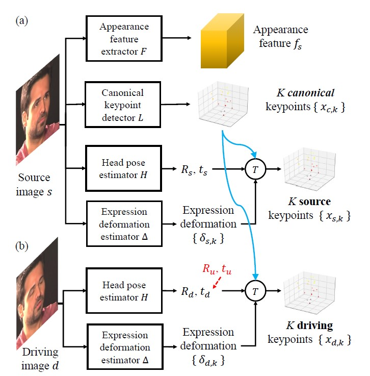

## One-Shot Free-View Neural Talking-Head Synthesis for Video Conferencing  

### 논문의 연구 목적 
---
 

 
 
&nbsp; 저자들은 카메라를 대놓고 말하는 사람에 대한 비디오를 바탕으로 deep neural network를 사용해 새로운 영상을 합성하고자 한다. 새로운 영상을 합성해낼 뿐만 아니라 비디오 압축 문제에 있어서도 효율성을 극대화하고자 한다. 

 
 

 

&nbsp;  첫째, talking-head image synthesis이다. talking-head image synthesis는 주어진 원본 영상의 말하는 사람에 대한 정보를 바탕으로 머리 위치와 감정 표현을 합성해낸다. talking-head image synthesis는 same-identity reconstruction과 cross-identity motion transfer라는 하위 분야로 나뉜다.  same-identity reconstruction은 원본 영상의 말하는 사람의 머리 위치와 감정 표현을 바꿔서 만들어낸다. 반면, cross-identity motion transfer는 어떤 영상에서 말하는 사람에 대해 원본 영상에서 말하는 사람의 머리 위치와 감정 표현을 적용하는 것이다.  
 

 

&nbsp; 둘째, face redirection이다. 원본 영상에서 말하는 사람의 감정 표현은 그대로 유지하되, 머리 위치를 바꾼 영상을 합성해내는 것이다. face redirection의 예로, 카메라에 말하는 사람의 얼굴의 정면이 보이게끔 하는 face frontalization이 있다.

 

&nbsp; 셋째, video compression이다. video compression은 말 그대로 비디오를 효율적으로 압축하는 것을 의미한다. 저자들은 새로운 모델을 제시 비디오 스트리밍에서 대역폭을 줄이고자 한다.

 

&nbsp;  저자들은 위에서 설명한 분야들의 state-of-the-art model들보다 뛰어난 성능을 보이는 것을 목표로 한다. 

 

### 선행 연구의 한계
---
 

&nbsp; talking head synthesis 분야와 video compression 분야에서 어떤 선행 연구들이 있었고, 각 연구에서의 한계가 무엇인지를 알아보고자 한다. 

 

&nbsp; talking head synthesis 분야에서는 첫째, 3D-based method가 있다. 3D-based method  중 subject-dependent model을 사용하는 전통적인 method가 있고, 최신 method로는 subject-agnostic model이 있다. 전통적인 모델인 subject-dependent model은 오직 한 인물에 대해서만 합성해낼 수 있고, 머리의 위치를 그대로 둔 채 감정 표현만 바꾸는 한계가 있다. 반면, 상대적으로 최신 모델인 subject-agnostic model은 인물에 대한 제약은 없지만, 머리카락, 치아, 장신구 등을 제대로 표현하지 못하는 한계가 있다. 

 

&nbsp; talking head synthesis 분야에서 둘째, 2D-based method가 있다. 2D-based method는 3D-based method와 달리 원본 영상으로부터 2D feature들을 추출해내 neural network의 추론 속도를 가속했다. 하지만 2D-based method도 고정된 관점에서의 비디오만 생성해낼 수 있어 한계에 부딪쳤다. 

 

&nbsp; video compression 분야에서는 hierarchcial interpolation, residual flow와 optical flow에 대한 encoding, 그리고 deep network 등 다양한 기술들로 압축률을 높이고자 했다. 하지만 특히 사람이 나오는 영상에 대해선 압축률이 낮은데, 저자들은 사람의 얼굴에 대한 내재적 구조를 고려한 keypoint와 metadata를 사용해 압축률을 높였다.

 

### Face-Vid2Vid
---
 

&nbsp; 저자들이 제시하는 Face-Vid2Vid 모델은 선행 연구의 한계들을 극복하여, 다음과 같은 장점을 지닌다. 

 

&nbsp; 첫째, Face-Vid2Vid 모델은 동일한 데이터셋에 대해 다른 state-of-the-art 모델들보다 우수한 성능을 지닌다.

  

&nbsp; 둘째, Face-Vid2Vid 모델은 3D 그래픽스 모델을 사용하지 않고서도 관점에 제약 없이 자유롭게 talking-head video를 생성해낼 수 있다.  

 

&nbsp; 셋째,  Face-Vid2Vid 모델은 비디오 스트리밍에서 시중에 나온 H.264 압축 방법보다 10배 더 효율적으로 대역폭을 줄일 수 있다.

 

### Core Components of Face-Vid2Vid
---
 

&nbsp; Face-Vid2Vid 모델은 세 가지의 핵심 구성 요소로 나누어진다. 

 

&nbsp; 첫째, 원본 이미지의 특징을 추출하는 요소이다.

 

&nbsp; 둘째, 머리의 위치와 감정 표현의 특징을 추출하는 요소이다.

 

&nbsp; 셋째, 추출해낸 특징들을 합쳐 새로운 영상을 생성해내는 요소이다.

 
 

&nbsp; 이 세 가지의 핵심 구성요소는

 

 

&nbsp; 첫 번째는 원본 이미지의 특징을 추출하는 요소이다

 

### Technical details of Face-Vid2Vid
---

 

 

	
### 실험
---
 

 

### 논문의 한계 및 배울 점 
---
