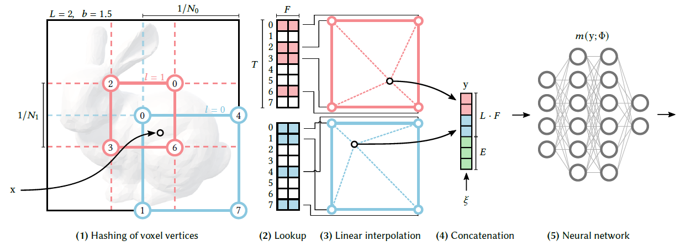

## InstantNGP - Instant Neural Graphics Primitives with a Multiresolution Hash Encoding 

### 논문의 연구 목적 
---
 

 
 
&nbsp; InstantNGP는 Neural Graphics Primitives 분야에서 Multiresolution Hash Encoding이라는 Input Encoding을 도입해 최적화된 accuracy와 training, inference speed를 내는 것을 목표한다.
 
 
&nbsp; Neural Graphics Primitives에 대해 설명하기에 앞서, Graphics Primitives는 Computer Graphics에서 사용되는 데이터 단위, 혹은 representation을 의미한다. Graphics Primitives는 외적인 모습을 parameterize하는 수학적 함수로 표현된다. Graphics Primitives의 예시로는, 2D Image, 3D Mesh, Multi-Dimensional Radiance Field 등이 있다. Neural Graphics Primitives는  Neural Network를 기반으로 만든 Graphics Primitives를 의미하며, Neural Network로는 주로 Fully-Connected Neural Network가 사용된다. InstantNGP는 적은 수의 Fully-Connected Neural Network를 사용해도 Multiresolution Hash Encoding 덕분에 좋은 성능을 보였다.
 
 
&nbsp; InstantNGP는 4가지의 구체적인 Neural Graphics Primitives 분야에서 성과를 보였다. 
 
&nbsp; 첫 번째는, GigaPixel Image Approximation으로 High Resolution Image를 압축하는 분야이다. 
 
&nbsp; 두 번째는, Signed Distance Functions (SDF)으로 어떤 점과 객체 간의 거리를 계산해 3D 객체를 생성하고 변형하는 분야이다.
 
&nbsp; 세 번째는,  Neural Radiance Caching으로 feature buffers를 활용해 사진과 같이 현실적인 pixel color들을 예측해내는 분야이다.
 
&nbsp; 네 번째는, Neural Radiance and Density Fields (NeRF)으로 5D spatial-directional function으로 새로운 관점에서의 이미지를 생성해내는 분야이다.

### 선행 연구의 한계
---
 
&nbsp; InstantNGP가 MultiResolution Hash Encoding이라는 input encoding을 도입하기 전에 선행 연구들은 한계점이 명확히 보이는 input encoding들을 사용했다.
 
&nbsp; 선행 연구들에서 사용된 input encoding의 종류와 그에 대한 한계를 구체적으로 살펴보고자 한다.
 
 
&nbsp; 첫째, linearly separable한 특성을 지닌 encoding이다. 복잡한 형태의 데이터를 선형적으로 분리시키는 초기 버전의 encoding으로, one-hot encoding과 kernel-trick이 대표적이다. 위와 같은 encoding은 자체적으로 sparse해지거나 curse of dimensionality가 발생할 수 있어, 단순히 고차원으로 mapping하는 encoding이라는 한계가 있다.
 
 
&nbsp; 둘째, frequency encoding이다. 대표적으로는 Transformer의 positional encoding이 있으며, sine 함수와 cosine 함수 같은 주기함수를 사용해 고차원 공간으로 mapping한다. frequency encoding은 mapping할 차원의 수만을 입력값으로 받아 아래에서 살펴볼 자체 학습 가능한 encoding들보다 accuracy가 떨어지는 단점이 있다.
 
 
&nbsp; 셋째, parametric encoding이다. parametric encoding은 grid나 tree와 같은 데이터 구조에 학습 가능한 parameter들을 배치하고, input vector에 맞게 parameter들을 interpolate하는 encoding이다.  parametric encoding은 frequency encoding보다 accuracy가 뛰어난 장점이 있지만, 학습 가능한 parameter들을 저장하고 처리하는 데 있어 memory footprint와 computational cost가 크다는 단점도 있다.
 
 
&nbsp; 넷째, sparse parametric encoding이다. sparse parametric encoding은 parametric encoding의 memory footprint와 computational cost 문제를 해결하기 위해 제안된 encoding이다. sparse parametric encoding은 octree나 sparse grid와 같은 데이터 구조를 사용해 dense grid에서 사용되지 않는 feature들을 제거하거나, coarse stage와 fine stage 같은 multi stage 구조로 feature grid에서 필요한 feature들만 정제하는 encoding이다. 하지만 sparse parametric encoding은 데이터 구조를 변형시키기 때문에 특정 작업에만 specific한 구조를 가지거나, feature grid를 주기적으로 update해야 해서 학습 과정이 복잡해진다.

### Instant NGP
---
 
&nbsp; InstantNGP는 

### Core Components of InstantNGP
---
 

 
 

### Technical details of InstantNGP
---
### 논문의 한계 및 배울 점 
---
