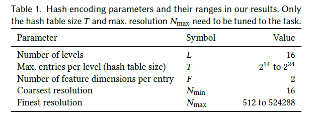
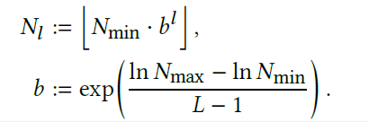
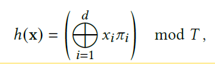
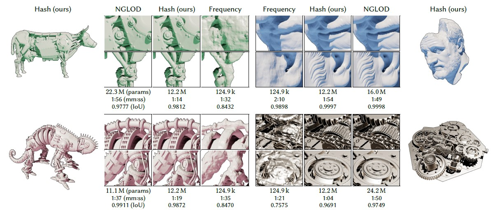
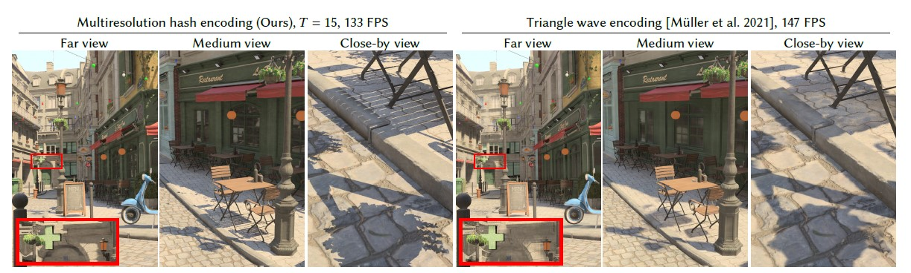
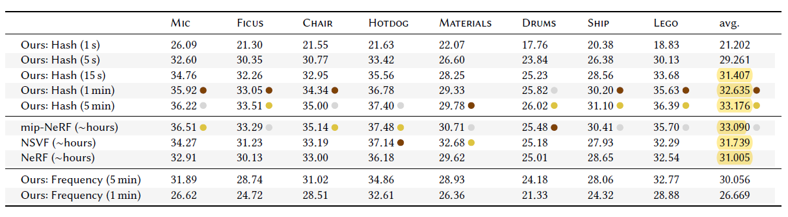

## InstantNGP - Instant Neural Graphics Primitives with a Multiresolution Hash Encoding 

### 논문의 연구 목적 
---
 

 
 
&nbsp; **InstantNGP는 Neural Graphics Primitives 분야에서 Multiresolution Hash Encoding이라는 Input Encoding을 도입해 최적화된 accuracy와 training, inference speed를 내는 것을 목표한다.**
 
 
&nbsp; Neural Graphics Primitives에 대해 설명하기에 앞서, Graphics Primitives는 Computer Graphics에서 사용되는 데이터 단위, 혹은 representation을 의미한다. Graphics Primitives는 외적인 모습을 parameterize하는 수학적 함수로 표현된다. Graphics Primitives의 예시로는, 2D Image, 3D Mesh, Multi-Dimensional Radiance Field 등이 있다. Neural Graphics Primitives는  Neural Network를 기반으로 만든 Graphics Primitives를 의미하며, Neural Network로는 주로 Fully-Connected Neural Network가 사용된다. InstantNGP는 적은 수의 Fully-Connected Neural Network를 사용해도 Multiresolution Hash Encoding 덕분에 좋은 성능을 보였다.
 
 
&nbsp; **InstantNGP는 4가지의 구체적인 Neural Graphics Primitives 분야에서 성과를 보였다.** 
 
&nbsp; 첫 번째는, GigaPixel Image Approximation으로 High Resolution Image를 압축하는 분야이다. 
 
&nbsp; 두 번째는, Signed Distance Functions (SDF)으로 어떤 점과 객체 간의 거리를 계산해 3D 객체를 생성하고 변형하는 분야이다.
 
&nbsp; 세 번째는,  Neural Radiance Caching으로 feature buffers를 활용해 사진과 같이 현실적인 pixel color들을 예측해내는 분야이다.
 
&nbsp; 네 번째는, Neural Radiance and Density Fields (NeRF)으로 5D spatial-directional function으로 새로운 관점에서의 이미지를 생성해내는 분야이다.

### 선행 연구의 한계
---
 
&nbsp; InstantNGP가 MultiResolution Hash Encoding이라는 input encoding을 도입하기 전에 선행 연구들은 한계점이 명확히 보이는 input encoding들을 사용했다.
 

&nbsp; **선행 연구들에서 사용된 input encoding의 종류와 그에 대한 한계를 구체적으로 살펴보고자 한다.**
 
 
&nbsp; 첫째, linearly separable한 특성을 지닌 encoding이다. 복잡한 형태의 데이터를 선형적으로 분리시키는 초기 버전의 encoding으로, one-hot encoding과 kernel-trick이 대표적이다. 위와 같은 encoding은 자체적으로 sparse해지거나 curse of dimensionality가 발생할 수 있어, 단순히 고차원으로 mapping하는 encoding이라는 한계가 있다.
 
 
&nbsp; 둘째, frequency encoding이다. 대표적으로는 Transformer의 positional encoding이 있으며, sine 함수와 cosine 함수 같은 주기함수를 사용해 고차원 공간으로 mapping한다. frequency encoding은 mapping할 차원의 수만을 입력값으로 받기 때문에 아래에서 살펴볼 자체 학습 가능한 encoding들보다 accuracy가 떨어지는 단점이 있다.
 
 
&nbsp; 셋째, parametric encoding이다. parametric encoding은 grid나 tree와 같은 데이터 구조에 학습 가능한 parameter들을 배치하고, input vector에 맞게 parameter들을 interpolate하는 encoding이다.  parametric encoding은 frequency encoding보다 accuracy가 뛰어난 장점이 있지만, 학습 가능한 parameter들을 저장하고 처리하는 데 있어 memory footprint와 computational cost가 크다는 단점도 있다.
 
 
&nbsp; 넷째, sparse parametric encoding이다. sparse parametric encoding은 parametric encoding의 memory footprint와 computational cost 문제를 해결하기 위해 제안된 encoding이다. sparse parametric encoding은 octree나 sparse grid와 같은 데이터 구조를 사용해 dense grid에서 사용되지 않는 feature들을 제거하거나, coarse stage와 fine stage 같은 multi stage 구조로 feature grid에서 필요한 feature들만 정제하는 encoding이다. 하지만 sparse parametric encoding은 데이터 구조를 변형시키기 때문에 특정 작업에만 specific한 구조를 가지거나, feature grid를 주기적으로 update해야 해서 학습 과정이 복잡해진다.

### Instant NGP
---
 

&nbsp; **InstantNGP는 선행 연구들에서 제시된 encoding들의 단점을 보완하기 위해 다음과 같은 특성을 지닌 encoding을 제시했다.**
 
 

&nbsp; 첫째, 학습 가능한 feature vector들을 spatial hash table에 저장한다. spatial hash table의 크기를 $T$라는 hyperparameter로 받아, parameter의 수와 reconstruction quality를 고려해 spatial hash table의 크기를 조정할 수 있게끔 만들었다.
 
 
&nbsp; 둘째, resolution의 크기에 따라 spatial hash table를 두고, spatial hash table들의 outputs를 concatenate하여 MLP(Multi Layer Perceptron)에 통과시킨다.
 
 
&nbsp; 셋째, hash function의 hash collision을 일부러 해결하지 않는다. hash function에 의해 만들어지는 hash table에서는 되도록이면 서로 다른  key가 동일한 hash를 가리키지 않아야 한다. 하지만 hash function이 hash의 수가 제한되어 있지만 무한히 key가 생성될 수 있는 함수이기 때문에, 비둘기집의 원리에 의해 필연적으로 서로 다른 key가 같은 hash를 가리키는 문제가 발생한다. 위와 같은 hash function의 문제를 hash collision이라고 한다. 그래서 일반적으로 hash function을 사용할 때는 어떻게든 hash collision을 최소화하려고 한다. 하지만 논문의 저자들은 일부러 hash collision을 해결하지 않는다. hash collision을 해결하지 않아도 spatial hash table들의 output vector들이 MLP에 통과되면, MLP가 backpropgation 과정에서 update에 중요한 hash entry를 구분해내기 때문이다.
 
 
&nbsp; **Multiresolution Hash Encoding의 특징에 따라 다음과 같은 장점을 지닌다.**
 
 
&nbsp; 첫째, training speed와 inference speed가 빨라진다. hash table entry에 대한 접근 속도가 빠를 뿐만 아니라, hash table 자체가 parallelization 연산에 특화되어 있기 때문이다.
 
 
&nbsp; 둘째, 특정한 task에 specific해질 수 있는 문제를 예방한다. Multiresolution hash encoding은 데이터 구조에 대한 특수한 변형이 없기 때문에 다양한 task들에 대해 일반적인 적용이 가능할 뿐만 아니라, 불필요한 control flow를 없애 GPU를 더 효율적으로 쓸 수 있도록 한다.

### Core Components of InstantNGP
---
 

 
 
&nbsp; **InstantNGP의 핵심 구성 요소는 Multiresolution hash encoding과 Fully connected neural network이다.**
 
 
&nbsp; 우선, Multiresolution hash encoding과 Fully Connected neural network에 대한 수식과 관련된 용어들을 살펴보고자 한다.
 
&nbsp; -  $\vec{x}$ : Multiresolution Hash encoding의  입력 좌표 
 
&nbsp; - $\theta$ : Multiresolution Hash encoding의 학습 가능한 parameters
 
&nbsp; - $\vec{y} = enc(\vec{x,} \theta)$ :  $\vec{x}$와 $\theta$에 대한 Multiresolution Hash encoding
 
&nbsp; - $\Phi$ : Fully connected Neural Network의 학습 가능한 parameters
 
&nbsp; - $m(y, \Phi)$ : Fully Connected Neural Network에 대한 수식
 

 
 
&nbsp; - $L$ : Multiresolution Hash Table의 총 개수 (= Multiresolution Hash Table의 Level)
 
&nbsp; - $T$ : Multiresolution Hash Table의 크기 (= Multiresolution Hash Table의 Level별 최대 entry 수)
 
&nbsp; - $F$ : Multiresolution Hash Table의 entry별 feature 수
 
&nbsp; - $N_{min}$ : Multiresolution Hash table의 resolution 중 가장 낮은 resolution의 크기
 
&nbsp; - $N_{max}$ : Multiresolution Hash table의 resolution 중 가장 큰 resolution의 크기
 
&nbsp; - $\xi \in R^{E}$ : neural network 이전에 concatenate될 때 추가되는 입력 데이터 (e.g., neural radiance changing에서 view direction과 textures)

 

 
 
&nbsp; - $b \in [1.26, 2]$ : Multiresolution Hash table의 resolution에 대한 growth factor
 
&nbsp; - $N_l$ : $N_{min}$과 $b$로 결정되는 각 level별 Hash table의 resolution 크기
 

 
 
&nbsp; - $d$ : 입력 좌표 $x$의 차원 수 
 
&nbsp;  - $\pi_i$ : $x_i$와 bit-wise XOR operation할 큰 소수 
 
&nbsp; - $\pi_1 := 1$, $\pi_2 := 2,654,435,761$ , $\pi_3 := 805, 459, 861$
 
 
&nbsp; 수식에서 사용되는 용어들에 대해 이해했으니, 다음으로 **Multiresolution Hash encoding과 Fully connected neural network가 작동하는 방식에 대해 알아보고자 한다.**
 
 
&nbsp;  첫째, 총 $L$개의 resolution level으로 이루어진  hash table마다  각각 $\vec{x}$를 hashing하여 $\vec{x}$의 corner에 index들을 할당한다.
 
&nbsp; 둘째, resolution level별로 각각 corner의 index들을 $F$ 차원의 벡터로 이루어진 hash table에 저장한다. 
 
&nbsp; 셋째,  $x$의 상대적 위치를 고려해 hash table에 저장된 index들을 선형 보간한다.
 
&nbsp; 넷째, 각 resolution level별로 선형 보간된 feature vector 및 부가적인 입력 데이터 $\xi$를 concatenate하여 neural network $m(y, \Phi)$에 학습시킨다.
 
&nbsp; 다섯째, $m(y, \Phi)$,  concatenated inputs, linearly interpolated inputs, 그리고 looked-up feature vectors에 backpropagation이 적용된다. 
 

### Technical details of InstantNGP
---
 
&nbsp; InstantNGP의 Multiresolution Hash encoding으로 발생하는 특징들, 그리고 hyperparameter에 대한 구체적인 설정들을 살펴보고자 한다.
 
 

&nbsp; **우선, InstantNGP의 Multiresolution Hash encoding으로 발생하는 특징들에 대해 알아보고자 한다.**
 
 
&nbsp; 첫째, Multiresolution Hash encoding의 설정에 따라 performance-quality tradeoff가 발생한다. Hash table의 크기 $T$,  Hash table의 레벨 수인 $L$, 그리고 ,feature의 차원 수인 $F$가 클수록 quality는 높아지지만, performance는 떨어진다. 논문의 저자들은 $T$를 $2^{14}$에서 $2^{24}$의 값으로, $L$을 16, $F$를 2의 값으로 설정하기를 권장한다.
 
 
&nbsp; 둘째, Multiresolution hash encoding이 hash collision 문제를 내부적으로 해결한다. coarse level resolution에서는 hash collision이 없는 반면, fine level resolution은 세세한 feature들도 포착하기 때문에 hash collision이 비교적 많이 발생한다. 하지만 학습 과정에서 빈 공간의 점보다 visibility나 density가 높은 점에서 gradient의 변화가 커 hash table entry들에 더 큰 영향을 미친다. 그로 인해 가중치가 높은 점을 반영하도록 table entry가 최적화되므로 자연스럽게 hash collision 문제가 해결된다.
 
 
&nbsp; 셋째, Multiresolution hash encoding은 학습 과정 중에 학습 데이터 분포에 자동적으로 적응하는 online adaptivity 특성을 지닌다. task-specific한 데이터 구조가 학습 중에 띄엄띄엄 배우는 것과 달리, multiresolution hash encoding은 hash collision을 줄이고, 더 정확한 함수를 학습할 수 있다.
 
 
&nbsp; 넷째, hash table entry들을 선형 보간함으로써 더 좋은 quality의 결과 데이터를 생성할 수 있다. 선형 보간 부분이 없더라도 encoding과 neural network 모두 연속함수이기 때문에 chain rule에 따른 미분이 가능하다. 하지만 hash table entry들을 선형 보간하지 않으면 선명도와 디테일이 떨어져 pixel들이 덩어리진, 즉, blocky한 appearance를 생성해낸다. 
 
 
&nbsp; **다음으로, InstantNGP의 hyperaparameter에 대한 구체적인 설정을 알아보고자 한다.**
 
 
&nbsp; 첫째, inference와 backpropagation performance를 최적화하기 위한 hyperparameter에 대한 설정이다. 먼저, Hash table entry를 half precision으로 저장하되 parameters에 대한 복사본은 full precision으로 저장해 mixed-precision parameter update를 하였다. 다음으로, coarse resolution hash table부터 시작해 resolution 순으로 연속적으로 GPU cache에 저장해 GPU cache를 효율적으로 사용했다. 그리고 feature vector의 차원 수인 $F$는 작을수록 cache locality를 살려 성능을 향상할 수 있고, 클 수록 memory coherence를 살려 성능을 향상할 수 있기 때문에 $F$가 2일 때 최적이라고 한다.
 
 
&nbsp; 둘째, Fully connected neural network의 hyperparameter에 대한 설정이다. NeRF를 다루는 neural network를 제외하고, 일반적으로 2개의 hidden layer은 각각 64개의 neuron으로 이루어져 있고, 활성화 함수는 ReLU이다. Fully connected neural network는 zero-initialization이나 uniform distribution $u(-10^{-4}, 10^{-4})$으로 네트워크를 초기화한다. 그리고 네트워크 가중치에 weak L2 regularization을 두어 오랜 학습 기간 후 발산하는 것을 방지한다. 
 
 
&nbsp; 셋째, gradient descent를 위해 필요한 optimizer, Adam의 hyperparameter에 대한 설정이다. Adam의 hyperparameter로 $\beta_1 = 0.9$, $\beta_2 = 0.99$, $\epsilon = 10^{-15}$을 사용하는데, 특히 $\epsilon$이 default값보다 훨씬 작다. $\epsilon$이 훨씬 작은 이유는 hash table entry에 대한 gradient 값이 sparse하고 weak할 때 수렴을 가속화하기 위해서이다. 그리고 gradient 값이 0인 hash table entry에 대해선 Adam을 적용하지 않는다. 
 
 
&nbsp; 넷째, 학습에 필요한 loss function에 대한 설정이다. GigaPixel Image와 NeRF에 대해선 L2 loss를 적용하고, Signed Distance Functions에 대해선 MAPE를 적용하고, Neural Radiance Caching에 대해선 luminance-relative L2 loss를 적용했다.
 
 
	
### 실험
---
 
&nbsp; 분야별 실험의 결과값을 논문의 표 혹은 직접 정리한 표로 설명해보고자 한다.
 
 
&nbsp; 먼저, GigaPixel Image Approximation에 대한 실험의 결과값이다.
 
 

|  |ACORN  | InstantNGP |
|--|--|--|
|DATASET |TOKYO panorma|TOKYO panorma  |
|PSNR |38.59 dB |41.9 dB |
|TRAINING TIME| 36.9 h |4 min  |
 
 
&nbsp; 다음으로, Signed Distance Functions에 대한 실험의 결과값이다.
 
 

 
 
&nbsp; 그리고, Neural Radiance Caching에 대한 실험의 결과값이다.
 
 

 
 
&nbsp; 마지막으로, Neural Radiance and Density Fields에 대한 실험의 결과값이다.
 
 

 
 

### 논문의 한계 및 배울 점 
---
