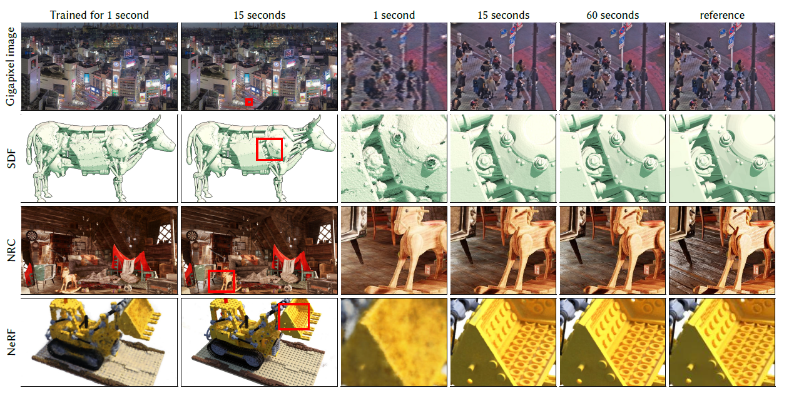

## InstantNGP - Instant Neural Graphics Primitives with a Multiresolution Hash Encoding 

### 논문의 연구 목적 
---
 

 
 
&nbsp; InstantNGP는 Neural Graphics Primitives 분야에서 Multiresolution Hash Encoding이라는 Input Encoding을 도입해 최적화된 accuracy와 training, inference speed를 내는 것을 목표한다.
 
 
&nbsp; Neural Graphics Primitives에 대해 설명하기에 앞서, Graphics Primitives는 Computer Graphics에서 사용되는 데이터 단위, 혹은 representation을 의미한다. Graphics Primitives의 예시로는, 2D Image, 3D Mesh, Multi-Dimensional Radiance Field 등이 있다. Neural Graphics Primitives는  Neural Network를 기반으로 만든 Graphics Primitives를 의미하며, Neural Network로는 주로 Fully-Connected Neural Network가 사용된다. InstantNGP는 적은 수의 Fully-Connected Neural Network를 사용해도 Multiresolution Hash Encoding 덕분에 좋은 성능을 보였다.
 
 
&nbsp; InstantNGP는 4가지의 구체적인 Neural Graphics Primitives 분야에서 성과를 보였다. 
 
&nbsp; 첫 번째는, GigaPixel Image Approximation으로 High Resolution Image를 압축하는 분야이다. 
 
&nbsp; 두 번째는, Signed Distance Functions (SDF)으로 어떤 점과 객체 간의 거리를 계산해 3D 객체를 생성하고 변형하는 분야이다.
 
&nbsp; 세 번째는,  Neural Radiance Caching으로 feature buffers를 활용해 사진과 같이 현실적인 pixel color들을 예측해내는 분야이다.
 
&nbsp; 네 번째는, Neural Radiance and Density Fields (NeRF)으로 5D spatial-directional function으로 새로운 관점에서의 이미지를 생성해내는 분야이다.

### 선행 연구의 한계
---
### Instant NGP
---
### Core Components of InstantNGP
---

### Technical details of InstantNGP
---
### 논문의 한계 및 배울 점 
---
