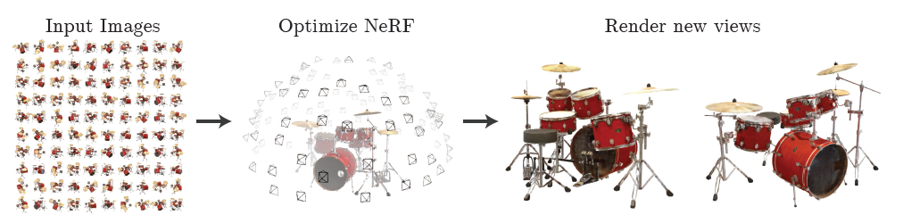
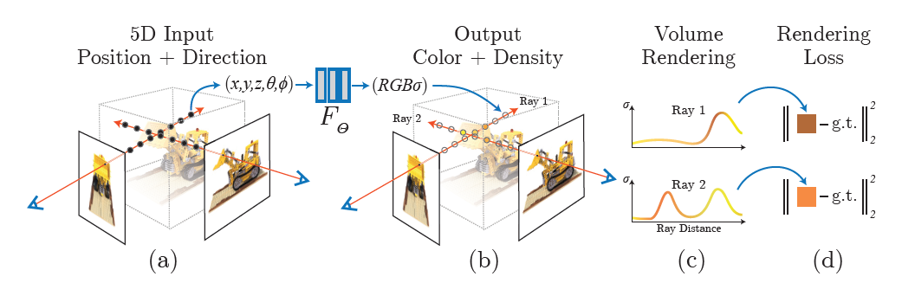

## NeRF : Representing Scene as Neural Radiance Fields for View Synthesis 

### 논문의 연구 목적 
---

 논문의 제목에서 알 수 있듯이 논문은 View Synthesis를 목표하고 있다. 
  
 View Synthesis는  complex scenes과 같은 입력 데이터를 활용해, 새로운 관점에서 바라본 scene을 생성하는 작업이다. 
  
  

 
 
NeRF는 드럼을 100가지 관점에서 바라본 입력 데이터들을 활용해, 기존의 관점과 다른 두 가지의 관점에서 바라본 드럼에 대한 scene을 생성한다.
 
 
### 선행 연구의 한계
---
NeRF라는 모델이 나오기 전에 View Synthesis를 다루는 모델은 크게 두 부류였다.
 
 
&nbsp; 첫째, 연속적인 3D shape을 사용하는 implicit representation인 'Neural 3D shape representations'이다. implicit representation이 무엇인지 먼저 알아보면, implicit representation은 연속적인 위치 좌표가 입력값이고, 위치 좌표의 scene property가 출력값인 함수의 형식이다. 반면, image, mesh, point cloud와 같은 explicit representation은 픽셀과 같은 불연속적인 위치 좌표를 입력값으로 받는다. explicit representation과 비교해볼 때,  implicit representation은 연속적인 위치 좌표를 계산함으로써 표현할 수 있는 signal이 연속적이게 된다. 따라서, implicit representationn은 neural network의 뛰어난 표현력에 적합한 형식이다. 
 
&nbsp; implicit representation인 Neural 3D shape representations은 위와 같은 장점이 있지만, xyz라는 3D 위치 좌표만을 사용하기 때문에 단점도 있다. xyz라는 3D 위치 좌표만을 입력값으로 받게 되면 단순한 shape와 낮은 geometric complexity에 제한되어 렌더링이 oversmooth되는 경향이 있다. NeRF는 선행연구의 한계를 극복하기 위해 5D radiance fields를 사용해 더 높은 해상도를 지닌 렌더링을 생성한다.
  
  
 &nbsp; 둘째, RGB image들을 활용해 높은 quality의 view synthesis를 목표로 하는 'sampled volumetric representations'이다. sampled volumetric representations은 다양한 형태와 재질을 표현할 뿐만 아니라, gradient 기반의 optimization에도 잘 맞는다. 최근의 sampled volumetric representation은 각 image로부터 voxel grids를 sample하고, 낮은 해상의 voxel grids의 불연속성으로 발생하는 noise들을 처리할 수 있는  CNN 구조를 지닌다. sampled volumetric representation은 위와 같은 이산적인 sampling으로 인해 고해상도의 이미지에서는 더 정교한 sampling이 요구되어, 처리 시간이 길어지는 단점도 있다. NeRF는 연속적인 volume을 fully-connected neural network에 인코딩하여 더 높은 해상의 렌더링을 더 낮은 비용으로 생성해낼 수 있다.
  
  
 ### 논문의 모델 설계
 ---
 
