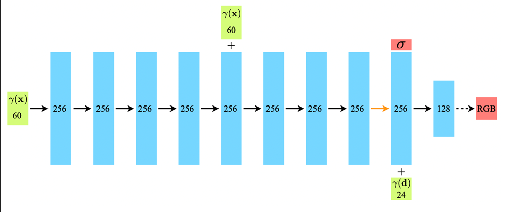
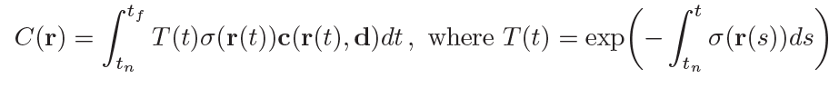
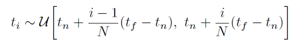
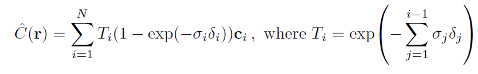
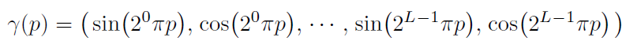
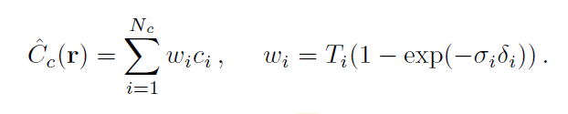
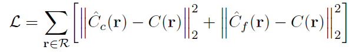
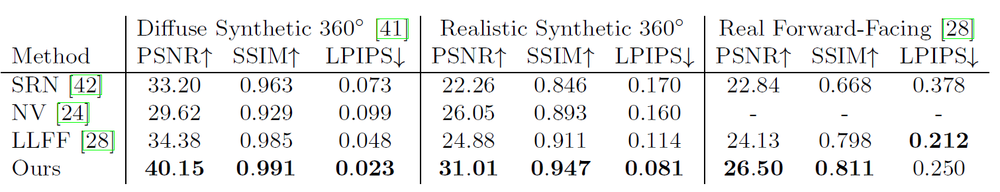
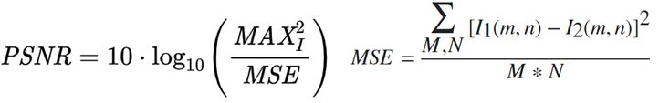
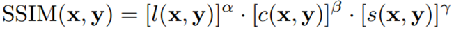

## NeRF : Representing Scene as Neural Radiance Fields for View Synthesis 

### 논문의 연구 목적 
---

 논문의 제목에서 알 수 있듯이 논문은 View Synthesis를 목표하고 있다. 
  
  
 View Synthesis는  complex scenes과 같은 입력 데이터를 활용해, 새로운 관점에서 바라본 scene을 생성하는 작업이다. 
  
  

 
 
NeRF는 드럼을 100가지 관점에서 바라본 입력 데이터들을 활용해, 기존의 관점과 다른 두 가지의 관점에서 바라본 드럼에 대한 scene을 생성한다.
 
 
### 선행 연구의 한계
---
NeRF라는 모델이 나오기 전에 View Synthesis를 다루는 모델은 크게 두 부류였다.
 
 
&nbsp; 첫째, 연속적인 3D shape을 사용하는 implicit representation인 'Neural 3D shape representations'이다. implicit representation이 무엇인지 먼저 알아보면, implicit representation은 연속적인 위치 좌표가 입력값이고, 위치 좌표의 scene property가 출력값인 함수의 형식이다. 반면, image, mesh, point cloud와 같은 explicit representation은 픽셀과 같은 불연속적인 위치 좌표를 입력값으로 받는다. explicit representation과 비교해볼 때,  implicit representation은 연속적인 위치 좌표를 계산함으로써 표현할 수 있는 signal이 연속적이게 된다. 따라서, implicit representationn은 neural network의 뛰어난 표현력에 적합한 형식이다. 
 
 
&nbsp; implicit representation인 Neural 3D shape representations은 위와 같은 장점이 있지만, xyz라는 3D 위치 좌표만을 사용하기 때문에 단점도 있다. xyz라는 3D 위치 좌표만을 입력값으로 받게 되면 단순한 shape와 낮은 geometric complexity에 제한되어 렌더링이 oversmooth되는 경향이 있다. NeRF는 선행연구의 한계를 극복하기 위해 5D radiance fields를 사용해 더 높은 해상도를 지닌 렌더링을 생성한다.
  
  
 &nbsp; 둘째, RGB image들을 활용해 높은 quality의 view synthesis를 목표로 하는 'sampled volumetric representations'이다. sampled volumetric representations은 다양한 형태와 재질을 표현할 뿐만 아니라, gradient 기반의 optimization에도 잘 맞는다. 최근의 sampled volumetric representation은 각 image로부터 voxel grids를 sample하고, 낮은 해상의 voxel grids의 불연속성으로 발생하는 noise들을 처리할 수 있는  CNN 구조를 지닌다. sampled volumetric representation은 위와 같은 이산적인 sampling으로 인해 고해상도의 이미지에서는 더 정교한 sampling이 요구되어, 처리 시간이 길어지는 단점도 있다. NeRF는 연속적인 volume을 fully-connected neural network에 인코딩하여 더 높은 해상의 렌더링을 더 낮은 비용으로 생성해낼 수 있다.
  
  
### NeRF Architecture 
---
 
  
  
 &nbsp; NeRF는 View Synthesis와 관련된 선행 연구들의 한계점을 극복하기 위한 세 가지 핵심 모듈이 있다.
  
  
 &nbsp; 첫째, 5D Neural Radiance Fields & MLP network이다. 3D 위치 벡터와 2D viewing direction 벡터를 모델의 입력으로 사용하고, 모델의 입력을 MLP에서 처리해 연속적인 장면들의 복잡한 기하학적 특징(e.g., density)을 추출한다.
  
  
 &nbsp; 둘째, Classical Volume Rendering & Stratified Sampling이다. 기존의 Volume Rendering 방식을 사용해, 추출된 volume의 density를 camera ray의 color로 렌더링한다. 그리고 렌더링된 camera ray의 color vector, $C(\vec{r})$과 비교할 NeRF에서 예측할 color vector, $\hat{C}(\vec{r})$을 만들기 위해 stratified sampling을 사용한다.
 
 
&nbsp; 셋째, Positional Encoding & Hierarchical Volume Sampling이다. Positional Encoding은 MLP가 5D Radiance Field라는 입력의 high-frequency representation을 학습할 수 있도록 돕는다. 그리고 Hierarchical Volume Sampling은 coarse network와 fine network라는 hierarchical representation을 활용해 최종 렌더링에 도움이 될 법한 sample들을 추출해 렌더링을 효율적으로 만든다. 
 
 
&nbsp; 정리해보면, NeRF는 3D location vector와 2D viewing direction vector라는 입력을 받아 View Synthesis에 필요한  color vector와 density를 출력하는 모델이다. 그리고 NeRF는 모델 내부에서 positional encoding, MLP, rendering, sampling 등 다양한 techniques을 활용해 high quality를 갖는 novel view synthesis를 목표로 한다.
 
 
### Core Components of NeRF
---
&nbsp;
&nbsp; 위에서 설명했던 NeRF의 구성 요소들을 구체적으로 살펴보고자 한다.
 
 
&nbsp; 처음으로 설명했던 5D Neural Radiance Fields와 MLP network를 알아본다.
 
 
&nbsp; 먼저, 5D Neural Radiance Fields에 속하는 3D location vector와 2D viewing direction vector는 다음과 같이 표현한다.
 
 
$$\vec{x} = (x, y, z)$$
$$\vec{d} = (\theta, \phi)$$
&nbsp; 다음으로, 5D Neural Radiance Fields를 입력으로 받아 color와 density를 출력하는 MLP는 아래와 같이 표현할 수 있다. 

 
 
&nbsp; 두 번째로 설명했던 Classical Volume Rendering과 Stratified Sampling을 살펴본다. 
 
 
&nbsp; Classical Volume Rendering과 관련된 수식은 다음과 같다. 
 
 

 
 
&nbsp; 하나씩 이해하면서 수식을 더 깊이 이해해보자. 
 
 
&nbsp; $t_n :$ camera ray의 가장 가까운 경계 지점 
 
 
&nbsp; $t_f:$ camer ray의 가장 먼 경계 지점 
 
 
&nbsp; $T(t):$ 축적된 투과율 (= camera ray가 $t_n$에서 $t$까지 지나면서 어떤 입자와도 충돌하지 않을 확률) 
 
 
&nbsp; $\sigma(\vec{x}):$ volume density (= 위치 $\vec{x}$에 존재하는 입자로 인해 camera ray가 중단될 확률)
 
 
&nbsp; $\vec{r}(t) = \vec{o} + t\vec{d} :$ $\vec{o}$는 ray의 원점, $\vec{d}$는 ray의 방향 벡터
 
 
&nbsp; 종합해보면, $t_n$에서 $t_f$ 사이의 camera ray $\vec{r}$의 color는 camera ray $\vec{r}$의 방향, $\vec{r}$이 입자와 충돌할 확률, $\vec{r}$이 입자와 충돌했을 때 중단될 확률을 고려한 것이다. 
 
 

 
 
&nbsp; Stratified Sampling은 MLP가 특정 구간에 쏠린 sample들을 학습하지 않도록 $t_n$에서 $t_f$ 사이를 $N$개의 구간으로 나누어 각 구간에서 한 sample씩 균등하게 추출될 수 있도록 한다. 
 
 
&nbsp;Stratified Sampling으로 추출된 sample들을 활용해 $C(\vec{r})$과 비교할 $\hat{C}(\vec{r})$을 계산한다.
 
 

 
 
&nbsp; $\delta_i = t_{i+1 }- t_i :$   $(i+1)$번째 sample과 $i$번째 sample 간의 거리. $i$번째 sample의 color에 대한 weight 역할을 함. 
 
 
&nbsp; $\alpha_i = 1 - exp(-\sigma_i\delta_i) :$  $\sigma_i$는 $i$번째 sample에서 존재하는 입자로 인해 camera ray가 중단될 확률. 이를 $\delta_i$와 곱해 $i$번째 sample 위치에서의 color에 대한 weight를 더 정확히 계산함. 
 
 
&nbsp; $\hat{C}(\vec{r})$은 각각의 sample의 color와 color의 weight에 대한 수식이다. 수식에 대한 설명이 부족해 저자들이 인용한 논문인 'Max, N. : Optical models for direct volume rendering'을 참고하는 게 좋을 듯하다.
 
 
&nbsp; 세 번째로 설명했던, Poisitonal Encoding과 Hierarchical Volume Sampling에 대해 구체적으로 알아본다. 
 
 
&nbsp; Positional Encoding과 Hierarchcial Volume Sampling은 고해상도의 복합적인 scene들을 표현하는 데 도움을 준다. 
 
 
&nbsp; Positional Encoding과 관련된 수식은 다음과 같다.
 
 

 
 
&nbsp; Positional Encoding인 $\gamma$는 $R$차원의 공간에서 $R^{2L}$차원의 공간으로 mapping함으로써 MLP가 higher frequency variation를 포함하는 데이터에 잘 맞도록 도와준다. 
 
 
&nbsp; Positional Encoding을 사용하지 않은 NeRF는 lower frequency variation에 맞춰져 View Synthesis로 생성된 novel view scene이 oversmooth되는 경향을 보였다.
 
 
&nbsp; Hiearchcial Volume Sampling과 관련된 수식은 다음과 같다.
 
 

 
 
&nbsp; $\hat{C}_c(\vec{r})$ : Coarse Network의 alpha composited color를 의미. alpha composited color는 alpha composition이 반영된 color임. alpha compositing은 opacity (불투명도)와 관련된 alpha channel에 대해 다루는 것으로, 객체를 배경과 자연스러워지도록 만드는 합성 기술이다. 
 
 
&nbsp; Fine Network의 alpha composited color는 이전에 살펴봤던 $\hat{C}(\vec{r})$으로 구할 수 있다. 
 
 
&nbsp; 최종적으로, NeRF의 Coarse Network와 Fine Network를 optimize하는 데 필요한  loss는 다음과 같다.
&nbsp;
 
 

 
 
 
&nbsp; $R$ :  각 batch의 ray들의 집합 
 
 
&nbsp; Coarse Network에서 예측한 color와 Fine Network에서 예측한 color를 각각 ground truth color와 뺀 후 제곱하는 Mean Sqaured Error를 사용했다.
 
 

### 실험
---
 
&nbsp; NeRF에 대한 실험에서 쓰인 dataset, 성능 측정 지표 및 실험 결과를 차례대로 살펴보고자 한다.
 
 

&nbsp; NeRF의 성능을 측정하기 위한 실험에서 사용된 dataset으로는 Diffuse Synthetic 360, Realistic Synthetic 360, 그리고 Real Forward-Facing이 있다. 
 
 
&nbsp; Diffuse Synthetic 360과 Realistic Synthetic 360 데이터셋 간의 큰 차이는 객체의 표면의 성질 및 해상도의 차이다. Diffuse Syntehtic 360 데이터셋의 객체는 표면의 성질이 람베르트 반사 성질을 지닌 반면, Realistic Synthetic 360 데이터셋의 객체는 람베르트 반사 성질을 지니지 않는다. 람베르트 반사 성질은 어느 시점에서 빛을 발사해도 모든 방향으로 균일하게 반사되는 성질이다.  그리고 Diffuse Synthetic 360 데이터셋의 해상도는 512 X 512인 반면, Realistic Synthetic 360 데이터셋의 해상도는 800 X 800이다.
 
 
&nbsp; Real Forward-Facing 데이터셋은 forward-facing camera로 포착된 실제 세상의 이미지로 이루어져 있으며, 해상도는 1008 X 756이다.
 
 

&nbsp; 다음으로, 성능 측정 지표 및 실험 결과에 대해 알아보고자 한다.
 
 

 
 
&nbsp; PSNR은 영상의 전송, 압축 등 영상 처리로 인해 발생하는 화질의 손실을 측정하는 지표이다. PSNR은 원본 이미지와 예측 이미지 간 각 픽셀의 오차인 MSE와  한 픽셀이 가지고 있는 정보량인 MAX로 구성되어 있다. 
 
 
&nbsp; PSNR에 대한 수식은 다음과 같다.
 
 

 
 
&nbsp; SSIM도 PSNR과 마찬가지로 변형된 화질의 손실을 측정하는 지표이다. SSIM은 두 이미지 $x$, $y$의 각각의 밝기인 luminance, 두 이미지 간의 밝기 차이인 contrast, 그리고 두 이미지 간의 상관 관계인 structure로 평가한다.
 
 
&nbsp; SSIM에 대한 수식은 다음과 같다.
 
 

 
 
&nbsp; LPIPS는 비교하는 두 이미지를 각각 VGG-Net에 넣고, 각 VGG-Net의 intermediate layer의 feature값들의 유사도를 측정하여 평가하는 지표이다.
 
 
&nbsp; PSNR, SSIM은 값이 높을수록, LPIPS는 값이 낮을수록, 예측 이미지가 실제 이미지와 유사하다는 뜻이다.
 
 
&nbsp; NeRF는 SRN, NV, LLFF 등의 다른 method들과 비교할 때, 성능 측정 지표 상 state-of-the-art의 성능을 보여줌을 알 수 있다.
 
 
### 논문의 한계 및 배울 점 
---
 
&nbsp; NeRF가 실험 결과 상 state-of-the-art 성능을 보였다고 하더라도 NeRF가 뛰어넘지 못한 한계들이 있다.
 
 

&nbsp; 첫째,  NeRF는 정적인 영상에 대해서만 사용 가능하다는 점이다. 둘째, NeRF는 새로운 관점에서 본 이미지를 생성하기 위해 상대적으로 많은 관점에서의 이미지가 필요하다는 점이다. 그리고 셋째, NeRF의 학습 시간과 추론 시간이 상대적으로 길다는 점이다. 
