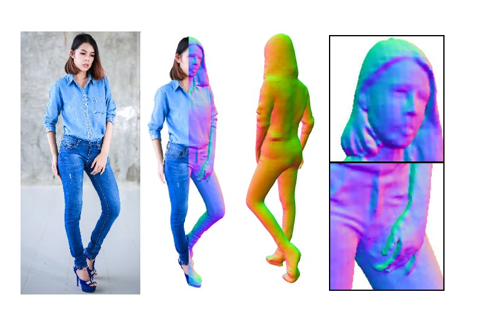
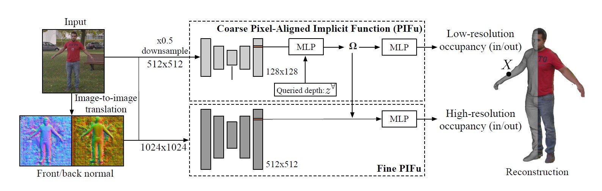
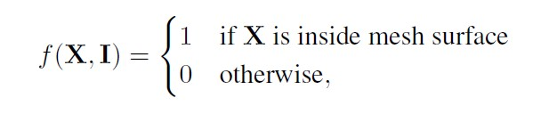
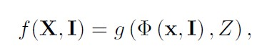
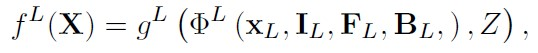
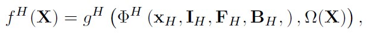

## PIFuHD : Multi-Level Pixel-Aligned Implicit Function for High-Resolution 3D Human Digitization 

### 논문의 연구 목적 
---
 

 
 
&nbsp; 논문의 제목에 나와 있듯이, PIFuHD는 2D 형태의 사람에 대한 이미지를 고해상도의 3D 형태로 재구성하고자 한다. PIFuHD의 저자들은 3D reconstruction 분야에서 해결하지 못한 문제들을 해결하고자 했다.

 
 

&nbsp;  첫째, PIFuHD는 1K 해상도의 2D 사람 이미지를 ,처음부터 끝까지 학습 가능한 coarse-fine network에 학습시켜 고해상도의 3D 사람 이미지를 구성해냈다.
 

&nbsp; 둘째, PIFuHD는 사람의 등 뒷부분과 같이 관측되지 않은 영역을 효과적으로 예측해 아주 좋은 디테일로 이미지를 완전히 재구성해냈다.

 

### 선행 연구의 한계
---
 

&nbsp; 선행 연구들은 3D Human Digitization에서의 고질적인 문제들을 해결하지 못했다. 3D Human Digitization 분야에서는 다음과 같은 선행 연구들이 있다. 

 

&nbsp; 첫째, parametric 3D model이다.  하나의 관점에서 바라보는 이미지를 바탕으로 다른 관점에서의 이미지도 구현해내야 하는 문제를 해결하기 위해 제안되었다. parametric 3D model은 미리 정해진 parameter들로 표현되는 body model을 설정해 위의 문제를 해결하고자 했지만, 여러 부작용도 있다. 이미 정해진 템플릿 형태의 mesh이기 때문에 다양한 사람 모델에 대한 표현력이 떨어진다는 점, 그리고 3D mesh가 부과하는 메모리 요구 조건이 cubic하기 때문에 고해상도의 이미지를 생성하기 어렵다는 점이 있다.

 

&nbsp; 둘째, texture map representation을 사용하는 연구들이다. texture map representation으로 높은 품질의 3D 질감과 기하학적 구조를 표현하고자 한다. 하지만 이 또한 결국엔, 정형화된 mesh와 UV  mapping(3D 표면에 2D 이미지를 mapping하는 기술로, 2D texture 좌표인 (u,v)를 사용하는 방식)의 parameter들로 제한되어 다른 스타일의 인간을 표현하지 못한다는 한계를 지니고 있다.

 

### PIFuHD
---
 

 

&nbsp; 위에 나온 PIFuHD의 구조를 통해 선행 연구들의 한계점들을 어떻게 극복했는지 알아보고자 한다.

 

&nbsp; 첫째, PIFuHD는 Pixel-Aligned Implicit Function을 사용한다. Pixel-Aligned Implicit Function, 줄여서 PIFu는,  전체 공간에서 특정 부분의 공간을 나눠서 메모리에 저장해야 되는 explicit representation과 다르다. PIFu는 어떤 위치의 3D 좌표에 대해서도 이 좌표가 인간 이미지에 포함되어 있는지 아닌지 구분할 수 있는 implicit function이다. PIFuHD는 PIFu를 활용해 메모리 효율성을 높이고, PIFu에 저장된 이미지 feature들로 local detail들을 살렸다.

 

&nbsp; 둘째, PIFuHD는 coarse-to-fine network이다. PIFuHD의 coarse network는 전반적인 3D 구조를 포착하고, fine network는 고해상도의 디테일을 잡아낸다. PIFuHD는 coarse-to-fine network로 질감과 깊이에 대한 3D representation을 예측해, 기존의 GAN 방식의 접근의 한계를 극복해냈다.

 

### Core Components of PIFuHD
---
 

&nbsp; PIFuHD의 핵심 구성 요소로, 첫째, PIFu가 있다. 3D Human Digitization은 3D 공간에서의 한 점이 사람의 신체인지 아닌지를 구분하는, occupancy의 측정 문제가 관건이다. PIFu는 연속적인 카메라 공간 $X = (X_x, X_y, X_z) \in R^3$에서 주어진 어떤 위치에 대해 binary occupancy value를 예측하는 $f(X)$ 함수이다. 

 

 

&nbsp; $I$는 하나의 RGB 이미지이다. 

 

 

&nbsp; PIFuHD에서 구체화된 PIFu는 위와 같고, 다음은 수식과 관련된 용어에 대한 설명이다.

 

&nbsp; - $x = \pi(X) = (X_x, X_y)$ : orthogonal projected 2D location

 

&nbsp; - $\Phi$  : CNN으로 이루어진 2D feature embedding 함수

 

&nbsp; - $\Phi(x,I)$ : $I$라는 이미지에서 $x$를 활용해 추출된 image feature embdding

 

&nbsp; - $Z = X_z$ : ray의 depth. 

 

&nbsp; - $g$ : Multilayer Perceptron 함수. 달라지는 ray의 depth $Z$에 주의해 3D 점들의 occupancy를 분별해야 함. 

 
 

&nbsp; 둘째, PIFuHD는 Multi-level PIFu를 사용해 기존의 PIFu의 단점을 보완했다. 하나의 PIFu로는 512 X 512에서 128 X 128 정도의 이미지 해상도로 제한된다. 저자들은 1024 X 1024 정도의 해상도로 3D Human Digitization하기 위해선 network의 구조가 top-down 구조이되, 각 level이 연결될 수 있는 intermediate supervision이 필요하다고 주장한다.  Multi-level PIFu의 모듈들을 구체적으로 살펴보고자 한다. 

 

 

&nbsp; - $I_L$ : 해상도를 낮춘 입력 이미지 

 

&nbsp; - $F_L$ : 앞면에 대한 예측된 normal map  / $B_L$ : 뒷면에 대한 예측된 normal map

 

&nbsp; - $x_L$ :  이미지 공간 $I_L$에서 투사된 2d location

 

 

&nbsp; - $\Omega(X)$ : coarse level network에서 추출된 3D 임베딩. 

 

&nbsp; 위에서의 수식들을 바탕으로 Multi-level PIFu에서 coarse level network와 fine level network의 차이를 알아보고자 한다. coarse level network는 512 X 512 해상도의 입력 이미지를 128 X 128 해상도의 feature들로 생성해내 전반적인 기하학적 정보 수집에 목표를 두고 있는 반면, fine level network는 1024 X 1024 해상도의 입력 이미지를 512 X 512 해상도의 feature들로 생성해 더 미묘한 디테일들을 잡아내는 데 집중한다. 그리고 fine network는 coarse level network에서 생성된 $\Omega(X)$를 입력으로 받기 때문에 구체적인 정보 포착에만 전념할 수 있다.

 
 

### Technical details of PIFuHD
---
	
### 실험
---

### 논문의 한계 및 배울 점 
---
