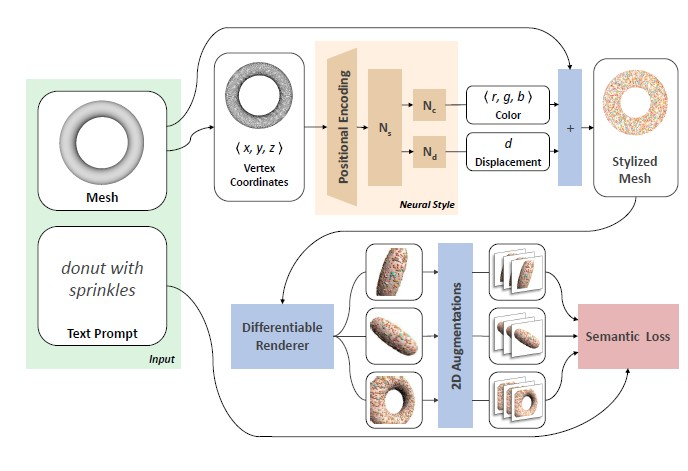
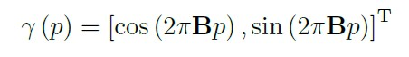
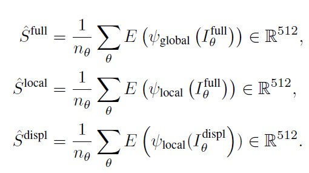
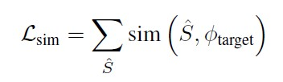
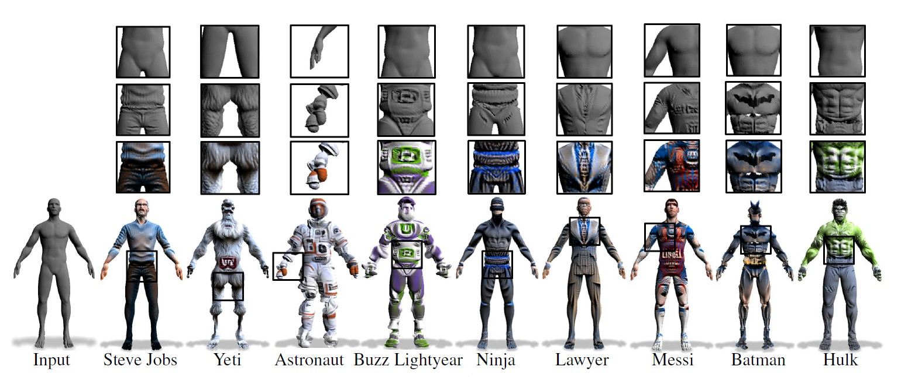
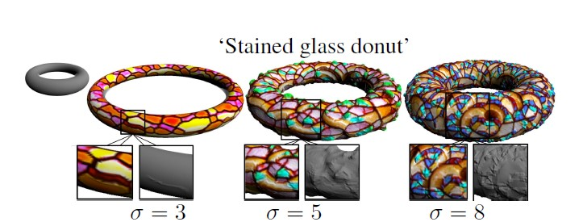
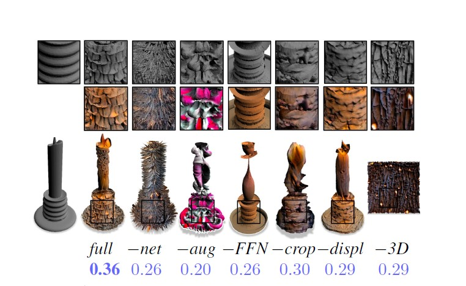
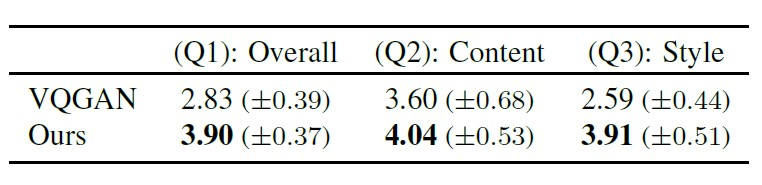

## Text2Mesh : Text-Driven Neural Stylization for Meshes

### 논문의 연구 목적 
---
 

 
  

**논문은 text prompt의 내용을 바탕으로 3D Mesh의 스타일을 semantic manipulation하는 것을 목표로 하고 있다.** 

 

위의 사진에서 논문의 모델은 'Astronaut Horse'라는 text prompt를 입력으로 받고, 말 모양의 3D Mesh를 생성하고,  우주복에 맞는 정교한 색상과 기하학적 디테일을 덧입힌다. 말 모양의 3D shape은 만들고자 하는 대상의 전반적인 형체와 구조를 나타내는 content이고, 우주복은 만들고자 하는 대상의 색상 및 기하학적 특징인 style이다.

 
semantic manipulation이 이미지나 비디오에서 객체를 의미에 맞게 수정하는 기술인 점을 알면, 논문이 text prompt를 기반으로 객체를 stylize하는 semantic manipulation 기술을 만들려는 것임을 알 수 있다. 

### 선행 연구의 한계
---
 

&nbsp; Text2Mesh와 관련된 선행 연구의 분야로 총 네 분야가 있다.  

 

&nbsp; 첫째, Text-Driven Manipulation이다. text의 설명을 바탕으로 manipulate하는 대표적인 기술로 CLIP이 있다. CLIP은 OpenAI에서 발표한 기술로, Contrastive Language-Image Pretraining의 약자이다. CLIP에서는 의미가 대응되는 image-text 쌍인 positive pair가 있고, 의미가 대응되지 않는 image-text 쌍인 negative pair가 있다. CLIP은 모든 image-text 쌍을 embedding space에 올리고,  positive pair에 대해선 유사도가 높게, negative pair에 대해선 유사도가 낮게 되도록 학습한다. 다만 CLIP은 2D Image에 대해서 연구가 활발히 진행되어 3D Geometry에서 의미있는 성과를 내지 못했다. Text2Mesh는 CLIP을 활용해 의미 있는 성과를 내고자 한다. 

 

&nbsp; 둘째, Geomteric Style Transfer in 3D이다. 대표적으로 3DStyleNet과 ALIGNet이 있다. 3DStyleNet은 target mesh를 바탕으로 content와 style을 생성해내고, ALIGNet은 template shape을 변형시켜 생성해낸다. 하지만 두 모델 모두 단순한 패턴의 style만을 만들 수 있으며, text와 같이 인간에게 직관적이며 간단한 서술만으로는 대상을 만들어낼 수 없다. 

 

&nbsp; 셋째, Texture Transfer in 3D이다. Texture Transfer는 mesh parameterization을 활용해 3D Mesh의 style을 제어한다. 하지만 mesh parameterization은 이미 정해진 parameter라는 엄격한 조건으로 3D Mesh를 만들기 때문에 실제로 존재하는 대부분의 mesh를 표현할 수 없다.  Text2Mesh는 Mesh의 모든 vertex에 대해 style value를 제공하는 neural field를 사용한다.

 

&nbsp; 넷째, Neural Priors and Neural Fields이다. 대표적으로 NeRF가 있다. NeRF는 3D Scene Modeling에서 성능이 좋지만, geometry와 appearance를 묶어서 처리하기 때문에 content와 style을 분리해서 제어할 수 없다. 또한 NeRF와 같은 Neural Fields는 정확하게 묘사하기 위해 렌더링 속도가 느리고 생성된 영상을 편집하기도 어렵다. Text2Mesh는 content에 대해선 explicit representation을 사용하고, appearance는 neural style field를 사용하는 disentangled representation이다.

### Text2Mesh
---
 

 

- $M$ : Input Mesh 
- $V$ :  $M$의 Vertices ($V \in \mathbb{R^{n\times3}}$)
- $F$ : $M$의  Faces ($F \in \{1, 2, ..., n\}^{m \times 3}$)
- $t$ : text prompt 
- $p$ : $V$에 속하는 하나의 정점 ($p \in V$)
- $M^s$ : Stylized Mesh 
- $N_s$ : style과 관련된 MLP
- $N_c$ : color와 관련된 MLP
- $N_d$ : displacement와 관련된 MLP
- $c_p$ : $N_s$의 output인 color feature. ($c_p \in [0, 1]^3$) 
- $d_p$ : $N_d$의 output인 displacement feature. ($d_p \in (-0.1, 0.1)$)

 

&nbsp; Text2Mesh는 input mesh가 target text에 맞는 mesh가 될 수 있도록 색상과 기하학적 디테일을 예측한다. 예측에 관여한 neural style network는 다량의 2D 이미지들을 렌더링하고, 그 이미지들을 증강함으로써 최적화한다. 최적화에 필요한 손실 함수는 CLIP에서 사용된 cosine similarity를 기반으로 한다. 

 

&nbsp; 저자들은 Text2Mesh의 핵심 구성요소로 첫째, Neural Style Field Network, 둘째, Text-based Correspondence, 셋째, Viewpoints & Augmentations를 제시한다. 

 

### Core Components of Text2Mesh
---
 

&nbsp; Text2Mesh의 첫 번째 핵심 구성 요소는 Neural Style Field Network이다. 

 

&nbsp; Neural Style Field Network는 $N_S$, $N_c$, $N_d$를 활용해 $p$를 $c_p$와 $d_p$로 매핑한다. 

 

&nbsp; Neural Style Field Network는 저차원의 coordinates를 사용하기 때문에 Fourier Feature Mappings과 같은 positional encoding을 사용한다. 이로써 Neural Style Field Network는 spectral bias를 극복하고 high-frequency functions으로 interpolate할 수 있다. 

 

 

- $\gamma(p)$ : positional encoding of $p$
- $B \sim \mathbb{N}(0, \sigma^2)$ :  random gaussian matrix ($B \in \mathbb{R}^{n\times3}$)

 

&nbsp; Neural Style Field Network에서 발생하는 구체적인 과정은 다음과 같다. 먼저, $p$가 unit bounding box에 속하게끔 normalize한다. 다음으로, positional encoding이 적용된 $p$인 $\gamma(p)$를 $N_s$에 통과시킨 후, $N_d$와 $N_c$로 네트워크를 분화한다. $N_d$와 $N_c$에서 각각 나온 $c_p$와 $d_p$를 활용해, 색상은 $c_p$, 기하학적 디테일은 $p$에서 $d_p \cdot \vec{n}_p$로 이동시켜 $M^s$를 만든다. 

 
 

&nbsp; Text2Mesh의 두 번째 핵심 구성요소는 Text-based Correspondence이다. Text-based Correspondence를 이루기 위해 미리 학습된 CLIP에서 제공하는 multi-modal embedding space를 활용한다. 이를 알아보기에 앞서 관련된 용어에 대해 정리하고자 한다. 

 

 - $M^S_{displ}$ : displaced mesh (예측된 color가 없는 $M^s$ )
 - $\theta$ :  미리 정의된 anchor view 
 - $n_\theta$ : sampling한 $\theta$의 개수
 - $I_\theta^{full}$ : $M^S$의 표면에 대한 2D projection
 - $I_\theta^{displ}$ : $M^S_{displ}$의 표면에 대한 2D projection 
 - $\psi_{global}$ : full view에 대한 2D Augmentation ($\psi_{global} \in \Psi_{global}$)
 - $\psi_{local}$ : uncolored view에 대한 2D Augmentation ($\psi_{local} \in \Psi_{global}$)

 

 

&nbsp; 주어진 $M^S$와 $M^S_{displ}$에 대해 $n_{\theta}$만큼 view를 sample해 differential renderer에서 렌더링한다. 다음으로, 렌더링된 $I_\theta^{full}$과 $I_\theta^{displ}$에 $\psi_{global}$과 $\psi_{local}$을 적용해 CLIP 공간에 임베딩한다. 그 후, 모든 view의 embedding을 average해 augmented representation을 생성한다. 

 

 

- $\hat{S} \in \{ \hat{S}^{full}, \hat{S}^{displ}, \hat{S}^{local}\}$ 
- $sim(a, b) = (a \cdot b) / (|a| \cdot |b|)$ : $a$와 $b$의 코사인 유사도
- $\phi_{target} = E(t) \in \mathbb{R}^{512}$ : CLIP을 통해 임베딩된 target $t$

 

&nbsp; 위와 같이 loss $L_{sim}$을 만들어주었다. 참고로, $\hat{S}^{full}$과 $\hat{S}^{local}$은 $N_s$, $N_c$, $N_d$를 update하지만, $\hat{S}^{displ}$은 $N_s$와 $N_d$를 update한다. 

 
 

&nbsp; Text2Mesh의 세 번째 핵심 구성 요소는 Viewpoints & Augmentations이다. Viewpoints는 다음과 같은 과정으로 이루어진다. 먼저, 주어진 3D Mesh와 target text로 anchor view를 찾는다. 다음으로, 3D Mesh를 렌더링해 각 view에서의 projection과 target text 간의 코사인 유사도를 구한다.  anchor view가 중심인 정규 분포에서 추출해낸 view들로 대상을 렌더링한다.  

 

&nbsp; Augmentations는 $\psi_{global}$과 $\psi_{local}$를 사용해 생성된다. $\psi_{global}$은 임의의 perspective transformation을 수반하고, $\psi_{local}$은 임의의 persepctive transformation과 원본 이미지의 10%를 임의로 crop한 것을 생성해낸다. cropping은 localized regions에서 MLP가 표면의 색상과 기하학적 특징을 더 정교하게 다루도록 도와준다. 

 

### Technical details of Text2Mesh
---

 

[Network Architecture]

 

- $\gamma(p)$ : 256-dimensional Fourier feature 
- 행렬 $B$가 따르는 분포의 표준편차 $\sigma$ : 5.0
- $N_s$ :  256-dimensional 4 layers with ReLU
- $N_d$ : 256-dimensional 2 layers with ReLU
- $N_c$ : 256-dimensional 2 layers with ReLU
-  final linear layer : weights initialized to 0 with tanh
- $c_p$ : divide output of $N_c$ by 2, and add [0.5, 0.5, 0.5]
- $d_p$ : multiply final layer with 0.1 

 

[Optimizer and Normalization]
- Adam optimizer  : (initial learning rate : 5e-4 / learning rate decay : 0.9 every 100 iters)
- Normalization : (mean $\mu$ : (0:48145466; 0:4578275; 0:40821073) / standard deviation $\sigma$ : (0:26862954; 0:26130258; 0:27577711) per-channel) 
 

	
### 실험
---
 

&nbsp; 실험에 COSEG, Thingi10K, Shapenet, Turbo Squid와 ModelNet 데이터셋이 사용되었다. 데이터셋의 데이터의 퀄리티를 제한하거나 데이터를 전처리하지 않고 그대로 넣었다고 한다. 

 

&nbsp; 저자들은 실험 결과를 통해 모델의 4가지 특징을 설명한다. 

 

 

&nbsp; 첫째, Text2Mesh로 content와 style에 대한 다양한 표현과 통제가 가능하다. Text2Mesh는 물체뿐만 아니라 사람에 대해서도 기본적인 구조는 유지하되,  semantic role에 맞게 각 대상을 stylize할 수 있다. 그리고 Text2Mesh는 positional encoding에서 사용되는 행렬 $B$와 관련된 표준편차 $\sigma$에 따라 생성하는 mesh의 style이 달라진다. 그 밖에도 Text2Mesh는 	서로 다른 stylized mesh의 style value를 linearly interpolate해 변형된 stylized mesh를 생성할 수 있다.

 

 

&nbsp; 둘째, Text2Mesh의 구성 요소들에 대한 ablation을 통해 구성 요소들이 필수적임을 보였다. 

 

 

&nbsp; style field network를 제거할 시, 표면에 noisy하며 arbitrary한 displacement가 생긴 것을 알 수 있다. positinal encoding인 Fourier feature encoding을 제거할 시, 정교한 디테일이 떨어짐을 알 수 있다. crop을 제거할 시, 목표와는 동떨어진 style을 합성해냄을 알 수 있다. $\hat{S}^{displ}$을 제거할 시, 기하적인 개선이 더 이상 불가능하다. geometric prior를 제거할 시, global structure를 담당할 source mesh가 사라져 2D image로 그려지게 된다. 

 

&nbsp;  셋째, Text2Mesh와 VQGAN 간 비교 설문조사를 통해 Text2Mesh가 VQGAN보다 Content나 Style면에서 우위에 있다는 응답이 많았다.

 

 

&nbsp; 넷째, Text2Mesh는 textual stylization을 넘어 서로 다른 target modality를 활용해 mesh를 stylize할 수 있다. 

### 논문의 한계 및 배울 점 
---

 

&nbsp; 저자들은 직접 논문의 한계점을 제시했다. 3D Mesh를 stylize할 때 content와 연관이 없는 prompt를 입력할 때, geometric prior를 무시해 source shape content가 지워지는 경우가 발생할 수 있다. 예를 들어, '스테인드 글라스'를 prompt로 받고, '용'이라는 3D mesh에 stylize하게 되면, 용의 형체가 깨진다는 것을 의미한다. 

