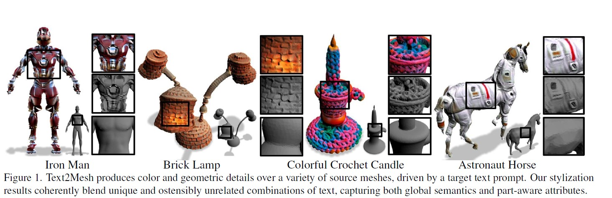

## Text2Mesh : Text-Driven Neural Stylization for Meshes

### 논문의 연구 목적 
---
 

 
 
&nbsp; 논문은 text prompt의 내용을 바탕으로 3D Mesh의 스타일을 semantic manipulation하는 것을 목표로 하고 있다. 

 

&nbsp;  위의 논문의 사진에서 논문의 연구 목적을 구체적으로 이해할 수 있다. 

 

&nbsp; 논문의 모델은 'Astronaut Horse'라는 text prompt를 입력으로 받고, 말 모양의 3D Mesh를 생성하고,  우주복에 맞는 정교한 색상과 기하학적 디테일을 덧입힌다. 

 

&nbsp; 말 모양의 3D shape은 만들고자 하는 대상의 전반적인 형체와 구조를 나타내는 content이고, 우주복은 만들고자 하는 대상의 색상 및 기하학적 특징인 style이다.

 
&nbsp; semantic manipulation이 이미지나 비디오에서 객체를 의미에 맞게 수정하는 기술인 점을 알면, 논문이 text prompt를 기반으로 객체를 stylize하는 semantic manipulation 기술을 만들려는 것임을 알 수 있다. 

### 선행 연구의 한계
---
 

&nbsp; Text2Mesh와 관련된 선행 연구의 분야로 총 네 분야가 있다.  

 

&nbsp; 첫째, Text-Driven Manipulation이다. text의 설명을 바탕으로 manipulate하는 대표적인 기술로 CLIP이 있다. CLIP은 OpenAI에서 발표한 기술로, Contrastive Language-Image Pretraining의 약자이다. CLIP에서는 의미가 대응되는 image-text 쌍인 positive pair가 있고, 의미가 대응되지 않는 image-text 쌍인 negative pair가 있다. CLIP은 모든 image-text 쌍을 embedding space에 올리고,  positive pair에 대해선 유사도가 높게, negative pair에 대해선 유사도가 낮게 되도록 학습한다. 다만 CLIP은 2D Image에 대해서 연구가 활발히 진행되어 3D Geometry에서 의미있는 성과를 내지 못했다. Text2Mesh는 CLIP을 활용해 의미 있는 성과를 내고자 한다. 

 

&nbsp; 둘째, Geomteric Style Transfer in 3D이다. 대표적으로 3DStyleNet과 ALIGNet이 있다. 3DStyleNet은 target mesh를 바탕으로 content와 style을 생성해내고, ALIGNet은 template shape을 변형시켜 생성해낸다. 하지만 두 모델 모두 단순한 패턴의 style만을 만들 수 있으며, text와 같이 인간에게 직관적이며 간단한 서술만으로는 대상을 만들어낼 수 없다. 

 

&nbsp; 셋째, Texture Transfer in 3D이다. Texture Transfer는 mesh parameterization을 활용해 3D Mesh의 style을 제어한다. 하지만 mesh parameterization은 이미 정해진 parameter를 기반으로 3D Mesh를 만들기 때문에 

### Text2Mesh
---
 

 

&nbsp; 위에 나온 PIFuHD의 구조를 통해 선행 연구들의 한계점들을 어떻게 극복했는지 알아보고자 한다.

 

&nbsp; 첫째, PIFuHD는 Pixel-Aligned Implicit Function을 사용한다. Pixel-Aligned Implicit Function, 줄여서 PIFu는,  전체 공간에서 특정 부분의 공간을 나눠서 메모리에 저장해야 되는 explicit representation과 다르다. PIFu는 어떤 위치의 3D 좌표에 대해서도 이 좌표가 인간 이미지에 포함되어 있는지 아닌지 구분할 수 있는 implicit function이다. PIFuHD는 PIFu를 활용해 메모리 효율성을 높이고, PIFu에 저장된 이미지 feature들로 local detail들을 살렸다.

 

&nbsp; 둘째, PIFuHD는 coarse-to-fine network이다. PIFuHD의 coarse network는 전반적인 3D 구조를 포착하고, fine network는 고해상도의 디테일을 잡아낸다. PIFuHD는 coarse-to-fine network로 질감과 깊이에 대한 3D representation을 예측해, 기존의 GAN 방식의 접근의 한계를 극복해냈다.

 

### Core Components of Text2Mesh
---
 

&nbsp; PIFuHD의 핵심 구성 요소로, 첫째, PIFu가 있다. 3D Human Digitization은 3D 공간에서의 한 점이 사람의 신체인지 아닌지를 구분하는, occupancy의 측정 문제가 관건이다. PIFu는 연속적인 카메라 공간 $X = (X_x, X_y, X_z) \in R^3$에서 주어진 어떤 위치에 대해 binary occupancy value를 예측하는 $f(X)$ 함수이다. 

 

 

&nbsp; $I$는 하나의 RGB 이미지이다. 

 

 

&nbsp; PIFuHD에서 구체화된 PIFu는 위와 같고, 다음은 수식과 관련된 용어에 대한 설명이다.

 

 - $x = \pi(X) = (X_x, X_y)$ : orthogonal projected 2D location

 - $\Phi$  : CNN으로 이루어진 2D feature embedding 함수

- $\Phi(x,I)$ : $I$라는 이미지에서 $x$를 활용해 추출된 image feature embdding

 - $Z = X_z$ : ray의 depth. 

 - $g$ : Multilayer Perceptron 함수. 달라지는 ray의 depth $Z$에 주의해 3D 점들의 occupancy를 분별해야 함. 

 
 

&nbsp; 둘째, PIFuHD는 Multi-level PIFu를 사용해 기존의 PIFu의 단점을 보완했다. 하나의 PIFu로는 512 X 512에서 128 X 128 정도의 이미지 해상도로 제한된다. 저자들은 1024 X 1024 정도의 해상도로 3D Human Digitization하기 위해선 network의 구조가 top-down 구조이되, 각 level이 연결될 수 있는 intermediate supervision이 필요하다고 주장한다.  Multi-level PIFu의 모듈들을 구체적으로 살펴보고자 한다. 

 

 

- $I_L$ : 해상도를 낮춘 입력 이미지 

 - $F_L$ : 앞면에 대한 예측된 normal map  / $B_L$ : 뒷면에 대한 예측된 normal map
 - $x_L$ :  이미지 공간 $I_L$에서 투사된 2d location

 

 

- $\Omega(X)$ : coarse level network에서 추출된 3D 임베딩. 

 

&nbsp; 위에서의 수식들을 바탕으로 Multi-level PIFu에서 coarse level network와 fine level network의 차이를 알아보고자 한다. coarse level network는 512 X 512 해상도의 입력 이미지를 128 X 128 해상도의 feature들로 생성해내 전반적인 기하학적 정보 수집에 목표를 두고 있는 반면, fine level network는 1024 X 1024 해상도의 입력 이미지를 512 X 512 해상도의 feature들로 생성해 더 미묘한 디테일들을 잡아내는 데 집중한다. 그리고 fine network는 coarse level network에서 생성된 $\Omega(X)$를 입력으로 받기 때문에 구체적인 정보 포착에만 전념할 수 있다.

 

 

 - $S$ : loss를 평가하기 위해 필요한 sample들의 집합

 - $\lambda$ : $S$에서 신체 밖에 있는 점들의 비율 

 - $f^{*}$ : 해당 위치의 실제 occupancy

 - $f^{{L ,H}}$ PIFu (Pixel-Aligned Implicit Function) 

&nbsp; 셋째, PIFuHD는 extended Binary Cross Entropy (BCE) loss를 사용한다. extended BCE loss뿐만 아니라 uniform volume samples와  importance sampling scheme을 합쳐 디테일을 살리 정확도를 높일 수 있다.

 

&nbsp; 추가적으로, 저자들은 network가 더 정교하게 재구성된 3D human digitization을 생성하기 위해선 feature extraction 과정에서 frontal normal map과 backside normal map을 image space의 proxy로 사용해야 한다고 주장한다.

 

### Technical details of Text2Mesh
---

 

[Network Architecture]

 

- coarse-fine network 구조가 stacked hourglass network 형태임.
- coarse level의 feature dimension은 128 X 128 X 256 
- fine level의 feature dimension은 512 X 512 X 16
- coarse level의 MLP의 neuron의 수는 (257, 1024, 512, 256, 128, 1) 
- coarse level의 MLP의 skip connection은 3, 4, 5번째 layer 
- fine level의 MLP의 neuron의 수는 (257, 512, 256, 128, 1)
- fine level의 MLP의 skip connection은 2, 3번째 layer 
- coarse level의 MLP의 input image size (512 X 512) / batch size - 8
- fine level의 MLP의 input image size (window crop / 512 X 512) / batch size - 8 

 

[Loss and Optimizer]
- coarse-fine network에 대한 optimizer : RMSProp (weight decay : 0.1 every 10 epochs)
- normal map의 network 에 대한 loss : $L_{VGG}$ (perceptual loss) $+$ $\lambda_{l1} L_{l1}$ (l1 distance)
- normal map의 network에 대한 optimizer : Adam (learning rate : 2e-4)
 

	
### 실험
---
 

 
&nbsp; 실험에  RenderPeople 데이터셋과 BUFF 데이터셋이 사용되었다. 

 

 

&nbsp; 실험 결과, Tex2Shape, PIFu, DeepHuman과 같은 기존의 연구와 달리, 사람의 얼굴의 윤곽과 옷의 주름 등의 질감을 더 자세히 표현해낸 것을 확인할 수 있다.

 

### 논문의 한계 및 배울 점 
---
e new files by opening the **file explorer** on the left corner of the navigation bar.

